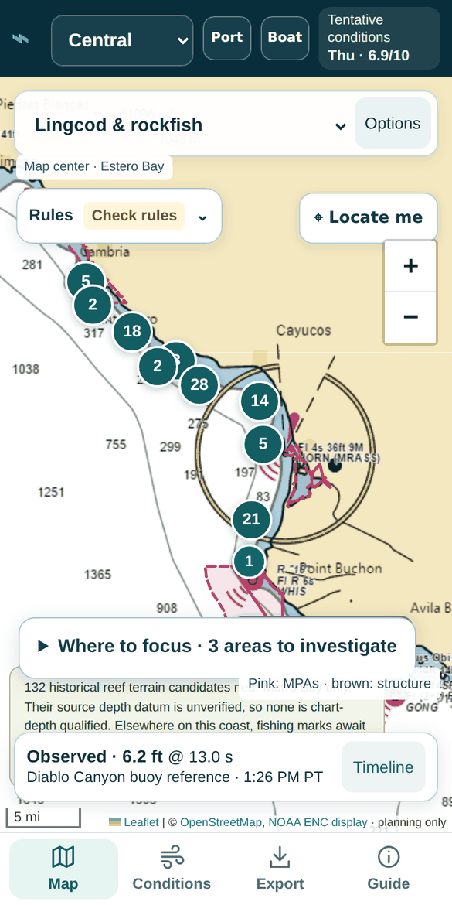

# SkipperCast

**A phone-first fishing map and ocean forecast for California boat anglers: where the structure is, what the water will do, and what the rules allow.**

**[Open the app](https://skippercast.com)** · [Documentation](docs/README.md)



## What you get

- **A fishing map on a nautical chart.** NOAA chart base, species selectors, reef and soft-bottom habitat candidates with their terrain evidence, marine protected areas, charter-reported grounds and a seafloor habitat layer built from original surveys.
- **A 7-day forecast chart.** One meteogram of wind and gusts, seas and period, tide and an hourly conditions score for your boat, built from SkipperCast's own NOAA and ECMWF forecast tiles, next to live buoy and weather-station readings.
- **A Tomorrow card.** For the next three days, go, marginal or no-go for each two-hour window, the one factor that limits the day, how well the models agree, and the latest comfortable time to be back at the dock.
- **The rules at a glance.** A regulations summary for the selected species, place and date: season status, bag and size limits, gear rules and links to the official CDFW pages, checked against the official sources every day.
- **Plans that go with you.** GPX export for chartplotters and iNavX, an offline trip pack for when the signal drops, and saved-trip alerts on a SkipperCast account you sign in to with a passkey.

## Coverage

California's outer coast, in regional packages. `active` is the main reviewed package; `preview` packages are still gathering reviewed evidence, and each one shows what it covers.

| Package | Status |
| --- | --- |
| Morro Bay & Avila | `active` |
| Southern California (Point Conception to the Mexican border, Channel Islands) | `preview` |
| Point Sal to Point Conception · Cambria–San Simeon · South Big Sur to San Simeon · Big Sur outer coast | `preview` |
| Monterey Peninsula to Point Sur · Pigeon Point to Monterey Bay · Point Reyes to Pigeon Point | `preview` |
| Bodega Bay to Point Reyes · Point Arena to northern Sonoma · Fort Bragg to Point Arena | `preview` |
| Shelter Cove to Fort Bragg · Humboldt Bay to Cape Mendocino · Crescent City & Del Norte | `preview` |

The whole coast can also be browsed by CDFW's five ocean regions, with seasonal species and protected areas ([coastal directory](docs/coastal-directory.md)). The package list is generated in [`dist/regions/index.json`](dist/regions/index.json).

## Run it

From the repository root, with Python 3.11+, Node 22 and pnpm:

```bash
python3 -m http.server 8485 --directory dist        # the app at http://localhost:8485
pip install -e ".[test]" && python3 -m pytest -m "not gis"   # Python tests, offline
pnpm install --frozen-lockfile && pnpm test           # Worker and browser tests
```

More in the [quickstart](docs/quickstart.md) and the [web app guide](docs/web-app.md).

## How it works

[Architecture](docs/architecture.md): one shared web app, a Cloudflare Worker with D1 and R2, and scheduled Python jobs that turn reviewed regional configuration and public data into published feeds.

## Data & trust

Every layer keeps its source, date and coverage state, and the app shows a gap as a gap rather than filling it in. [Data confidence](docs/product/data-confidence.md) explains the grades, coverage states and freshness rules, and [data sources](docs/data-sources.md) lists every provider with its licence.

## Status

A working mobile web app, version 0.3. See the [roadmap](docs/roadmap.md) and [changelog](CHANGELOG.md). The Text Advisor (text SkipperCast for reports, rules and fish IDs) is being built dark behind `TEXT_ADVISOR_ENABLED`: the channels, media intake, vision, the conversation engine, the rules table, the data tools (reports, conditions, rules, species, rigging, trips), skipper registration, skipper fish reports (count-board photos, typed counts, confirmation and corrections) the anglers' fish ID with photo sharing, the daily port answers ("what's biting", in English and Spanish) the trip planning brief (advisory first, one confidence phrase), the media runner job (derived photos, the Story footer, the daily and roundup graphics) and the public port, species and boat pages are in, in English and Spanish, with an admin review queue and health view for the team; the rest of the admin app is next ([plan](docs/plans/text-advisor/README.md)).

## License

Source-available for personal use under the [SkipperCast Personal Use License](LICENSE); third-party data keeps its own terms ([NOTICE.md](NOTICE.md)).

## Contributing

Read [CONTRIBUTING.md](CONTRIBUTING.md) and [AGENTS.md](AGENTS.md) before opening a pull request.
