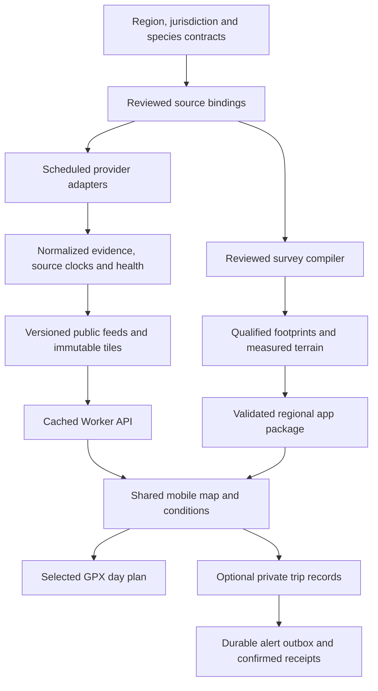

# Architecture

SkipperCast separates regional configuration from provider adapters, evidence products and the shared mobile app. Start with [the platform](platform.md), [the data-quality rollout](data-quality-rollout.md) and [production operations](production-operations.md).

| Component | Responsibility |
| --- | --- |
| `regions/`, `catalog/`, `jurisdictions/` | Bind provider-independent data needs to reviewed geographic sources, species evidence and rules. |
| `src/skippercast/pipeline/` | Collect dated public evidence, retain missing/stale states, produce ocean tiles, and compare prospective forecasts with observations. |
| `src/skippercast/platform/` | Validate regional contracts and scoped survey qualifications; compile shared browser packages. |
| `dist/` | Authored mobile map, conditions, evidence cards, measured bottom views and selected chartplotter exports. Generated `client/` and `server/` subdirectories are ignored. |
| `server/`, `db/`, `drizzle/` | Cached public feeds, authenticated private records, migrations, saved-trip checks and durable delivery state. |
| `.github/workflows/` | Offline tests, native scientific tests, half-hourly public conditions and daily source/rule checks. |
| `src/skippercast/monitor/` | Separate collector and pure alert-lifecycle utilities for the private Morro Bay monitoring workflow. |

## Evidence boundaries

Every regional product retains source identity, acquisition and valid times, native resolution, masks, uncertainty where available, rights and recorded failures. A partial region can publish a hash-validated survey subset without claiming the entire region is surveyed. Current protected-area checks remain independent of an older compilation receipt.

Bottom scores rank mapped physical habitat, not catch probability. Satellite measurements describe surface water; modeled surface flow is not bottom current or measured boat drift. Forecast fields stop at populated provider hours. [Prospective verification](forecast-verification-quality.md) requires distinct weather outcomes, geographic matching and adequate coverage before making model-performance claims.

The browser receives cached public feeds, with source-specific recovery paths. Private records require authentication and are isolated from public feeds. Scheduled private checks use the configured workflow identity; delivered state requires a successful adapter receipt. Credentials and personal delivery records are not source data. See [production operations](production-operations.md) for deployment and security details.

## Independent monitor workflow

The Morro Bay example collector saves raw evidence and flags gaps. A person or agent still reviews the complete routed trip, departure and return entrance conditions, daylight and actual fishing time. Its pure lifecycle function operates on already reviewed assessments and successfully delivered state. The external personal-monitor integration is separate from the public website's optional saved-trip alert system; neither certifies a safe passage or predicts catches.

## Extension process

Add a regional contract and reviewed sources, run real imports, validate coverage and species relevance, then pass tests and an observed scheduled publication. [Region setup](regions.md) and the [quality gates](data-quality-rollout.md) define that process. Keep new areas partial until the evidence supports more precise claims.
