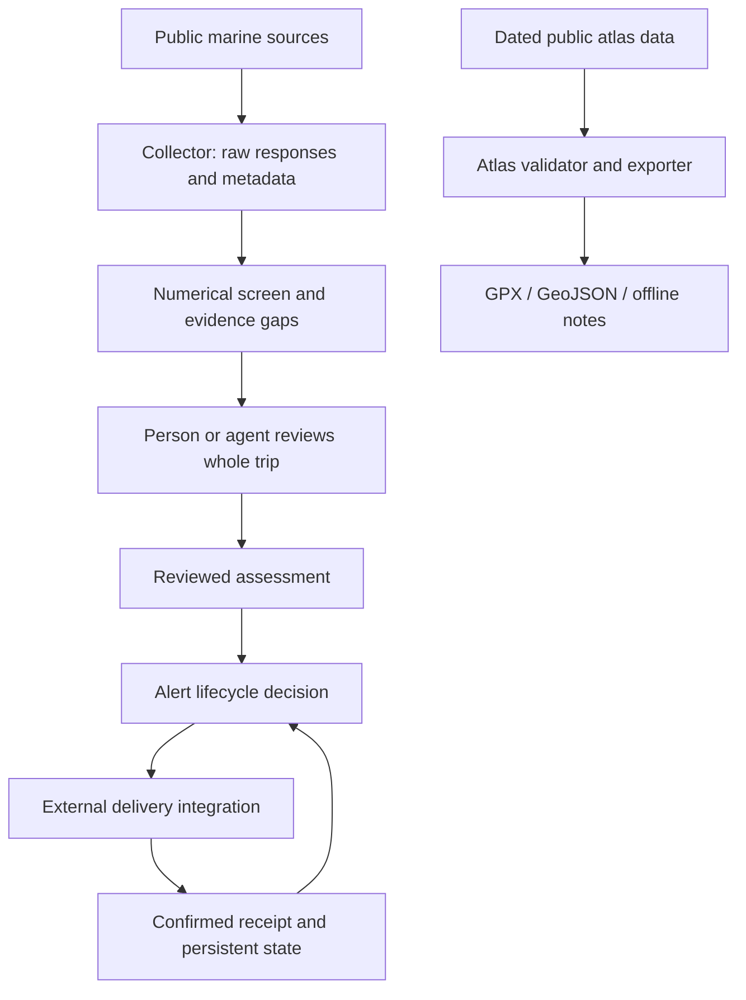

# Architecture

The implemented regional platform is documented in [A reusable coastal fishing system](platform.md). It separates data needs, reviewed providers, jurisdictions and regional packages, with scheduled feeds and measured bottom views. The monitor workflow below remains a separate, private operational path.

For a visual introduction to the intended app, see [the system overview: data flow, chart layers, and software stack](system-overview.md).

SkipperCast has a static web app and two independent Python research paths. The atlas can be used without running the monitor; the collector can be used without importing any waypoints. The [web app](web-app.md) reads the public atlas directly and requests forecast evidence from providers in the browser. It does not run the Python collector or alert delivery.

The repository implements the collector, numerical screen, alert-decision functions, and atlas exports. The review step, delivery integration, persistent delivery-state manager, and scheduler are external responsibilities. The diagram shows the complete intended workflow, not a claim that all boxes are automated.

| Module / artifact | Responsibility | Does not do |
| --- | --- | --- |
| `dist/` | Interactive map, selected-target GPX, live browser forecast comparisons and source metadata | Predict catches, qualify trips, display live legal closures, save personal records, send alerts |
| `monitor/collector.py` | Fetch public sources, preserve access results, create a numerical screen and data-gap flags | Assign trip scores, resolve every source conflict, determine safety, send alerts |
| `monitor/lifecycle.py` | Apply qualification and notification rules to caller-supplied reviewed assessments and delivered state | Evaluate weather, verify a statement is true, store state, ensure delivery |
| `atlas/scoring.py` | Reproduce the fixed terrain-priority formula from measured metrics | Infer species presence, catch rate, fish size, or current drift |
| `atlas/export.py` | Validate internal references/recorded checks; export included data | Rebuild native GIS surveys or prove present legal/navigation clearance |
| `configs/morro-bay.example.json` | Document the regional example's boat, limits, and sample points | Supply credentials or generalize source selection automatically |

## Evidence and decision boundaries

Forecast raw bodies and per-source metadata are saved before review. A source can be accessible but incomplete, stale, internally inconsistent, or spatially inappropriate. The numerical screen records those concerns where implemented; a person or agent must inspect remaining source limitations.

The hourly screen uses a broad 06:00–13:00 local window as a starting point. An actual assessment needs the charted departure-to-return route, harbor time, daylight, and at least four real fishing hours. A passed screen is not proof that a workable trip exists.

An alert decision is a pure function. The caller must supply state representing **successfully delivered** alerts, not attempted sends. A production integration needs durable locking, stable event IDs, receipts, failure reporting, and reconciliation of ambiguous attempts. Those operational features are intentionally not claimed by this initial package.

## Geographic scope

The monitor profile uses Morro Bay as the departure harbor and examines Cambria–Diablo Canyon. The published atlas covers only the three USGS survey areas with verified reuse terms. It contains no complete navigation network, live MPA service, bar-current model, or worldwide fishing-location database.

## Runtime and side effects

Core modules use Python's standard library. Importing modules does not fetch data or write outputs. `demo` and tests are offline. `collect` performs explicit network reads and creates a new run directory. `atlas export` writes a new output directory. No command contacts a Telegram bot, creates a schedule, or configures a hosting provider.
