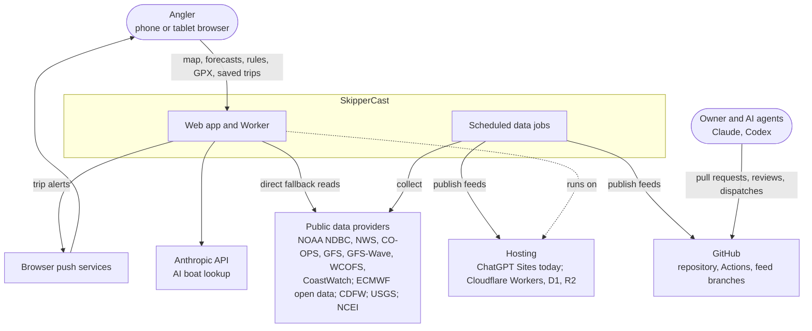
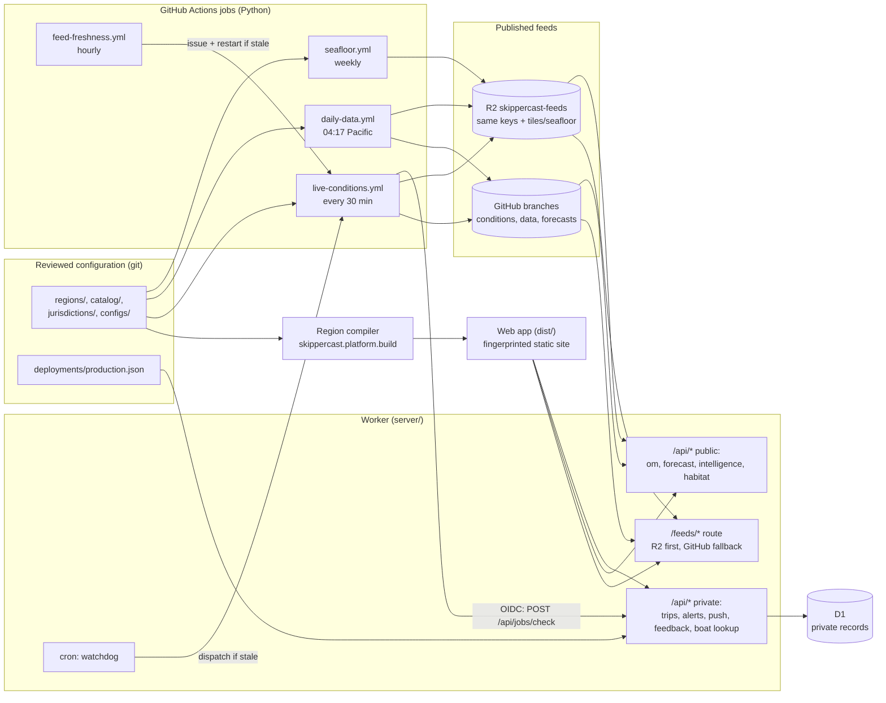

# Architecture

SkipperCast is one shared mobile web app, one Cloudflare-style Worker, and a set of scheduled Python jobs that turn reviewed regional configuration and public data into published feeds. Regions are configuration, not forks: adding a coast is a data task. This page is the current map of the system; start here, then follow the links. The full documentation index is [docs/README.md](README.md).

> The older [system overview](archive/system-overview.md) is a superseded design snapshot. Detailed, dated rollout and research logs are in the [archive](archive/README.md).

## System context

Who and what SkipperCast talks to.

```mermaid
flowchart TB
    angler(["Angler<br/>phone or tablet browser"])
    owner(["Owner and AI agents<br/>Claude, Codex"])
    subgraph sc["SkipperCast"]
      app["Web app and Worker"]
      jobs["Scheduled data jobs"]
    end
    providers["Public data providers<br/>NOAA NDBC, NWS, CO-OPS, GFS, GFS-Wave, WCOFS,<br/>CoastWatch; ECMWF open data; CDFW; USGS; NCEI"]
    ghub["GitHub<br/>repository, Actions, feed branches"]
    cloud["Hosting<br/>ChatGPT Sites today; Cloudflare Workers, D1, R2"]
    anth["Anthropic API<br/>AI boat lookup"]
    pushsvc["Browser push services"]
    angler -->|"map, forecasts, rules, GPX, saved trips"| app
    app -->|"trip alerts"| pushsvc
    pushsvc --> angler
    app --> anth
    app -->|"direct fallback reads"| providers
    jobs -->|"collect"| providers
    jobs -->|"publish feeds"| ghub
    jobs -->|"publish feeds"| cloud
    app -. "runs on" .-> cloud
    owner -->|"pull requests, reviews, dispatches"| ghub
```

## Containers

The runtime pieces and how data moves between them.

```mermaid
flowchart LR
    subgraph config["Reviewed configuration (git)"]
      regions["regions/, catalog/,<br/>jurisdictions/, configs/"]
      deploy["deployments/production.json"]
    end
    subgraph jobs["GitHub Actions jobs (Python)"]
      live["live-conditions.yml<br/>every 30 min"]
      daily["daily-data.yml<br/>04:17 Pacific"]
      seafloorjob["seafloor.yml<br/>weekly"]
      fresh["feed-freshness.yml<br/>hourly"]
    end
    subgraph stores["Published feeds"]
      branches[("GitHub branches<br/>conditions, data, forecasts")]
      r2[("R2 skippercast-feeds<br/>same keys + tiles/seafloor")]
    end
    subgraph edge["Worker (server/)"]
      feedsroute["/feeds/* route<br/>R2 first, GitHub fallback"]
      api["/api/* public:<br/>om, forecast, intelligence, habitat"]
      private["/api/* private:<br/>trips, alerts, push, feedback, boat lookup"]
      cron["cron: watchdog"]
    end
    d1[("D1<br/>private records")]
    web["Web app (dist/)<br/>fingerprinted static site"]
    compiler["Region compiler<br/>skippercast.platform.build"]
    regions --> compiler --> web
    regions --> live & daily & seafloorjob
    live --> branches
    live --> r2
    daily --> branches
    daily --> r2
    seafloorjob --> r2
    branches --> feedsroute
    r2 --> feedsroute
    r2 --> api
    branches --> api
    web --> feedsroute & api & private
    private --> d1
    live -->|"OIDC: POST /api/jobs/check"| private
    cron -->|"dispatch if stale"| live
    fresh -->|"issue + restart if stale"| live
    deploy --> private
```

## Components

| Component | Where | Responsibility | More |
| --- | --- | --- | --- |
| Regional configuration | `regions/<id>/region.json` (15 packages), `catalog/`, `jurisdictions/`, `configs/` | Binds provider-independent data needs to reviewed sources, species, ports, forecast points, marine zones and rules for each coast | [Platform](platform.md), [add a coastline](regions.md), [data contracts](data-contracts.md) |
| Region compiler | `src/skippercast/platform/` | Validates contracts and survey qualifications; writes `dist/regions/index.json` and each region's `region.json`, `coverage.json`, `manifest.json`; CI fails if the output drifts from its sources | [Region pipeline](region-pipeline.md) |
| Evidence pipeline | `src/skippercast/pipeline/`, `scripts/refresh_regions.py` | Collects buoys, weather, alerts, tides, satellite and radar ocean data, dated reports and regulations per region; keeps `ok/stale/missing/failed/retained` distinct; records a receipt per request; hash-bound regulation review | [Live conditions](live-conditions.md), [bite evidence](bite-evidence.md), [regulations](regulations.md), [dynamic habitat](dynamic-species-method.md), [verification](forecast-verification-quality.md) |
| Forecast tile builder | `src/skippercast/forecast/`, `scripts/publish_forecasts.sh` | Builds wind and wave tiles from NOAA GFS / GFS-Wave and ECMWF IFS / WAM open data with byte-range GRIB reads; publishes the `forecasts` branch as a single commit and mirrors to R2 | [Forecast data](forecast-data.md) |
| Forecast service | `server/model-api.js` | Answers Open-Meteo-style queries (`/api/om/v1/forecast`, `/marine`) from those tiles; also used by the Python jobs through `scripts/model_api.mjs` | API reference ([pending](#pending-documents)) |
| Seafloor pipeline | `src/skippercast/seafloor/`, `.github/workflows/seafloor.yml` | Original-survey ingestion, terrain and substrate grading, legal screening, regional PMTiles archives published to R2 with a checksum manifest and expiry, verified by HTTP Range read-back | [Seafloor](seafloor.md) |
| Dated habitat atlas | `atlas/avila-point-estero-2026-09-20/`, `src/skippercast/atlas/` | The September 2026 Morro Bay–Avila research atlas and its GPX/notes exporter | [Atlas methodology](atlas-methodology.md) |
| Web app | `dist/*.html`, `dist/*.js`, `dist/*.css`, `dist/vendor/` | Mobile map (Leaflet), Conditions, Export and Guide views; loads regions from `regions/index.json` and every feed through `/feeds/` | [Web app](web-app.md) |
| Build | `scripts/build-worker.mjs`, `scripts/fingerprint.mjs`, `scripts/check_client.mjs` | Copies `dist/` to `dist/client`, content-hashes every script, style and page, and bundles the Worker to `dist/server/index.js` with the reviewed regions, deployment policy, page map and build id compiled in | [README](../README.md) |
| Worker | `server/index.ts`, `server/app.ts` (Hono), `server/routes/`, `server/middleware/` | TypeScript (`pnpm typecheck`). Routes pages (hashed shells served `no-store`), `/feeds/*`, the public API and the private API; identity from ChatGPT Sites headers only when `IDENTITY_PROVIDER=chatgpt-sites` | [Cloudflare](cloudflare.md), [production operations](production-operations.md) |
| Feeds route | `server/feeds.ts` | `GET /feeds/<branch>/<path>`: R2 first (Range, ETag), then static assets for `tiles/`, then the GitHub branch; seafloor archives only with a current receipt | [Cloudflare](cloudflare.md) |
| Private records | `db/schema.ts`, `drizzle/`, D1 binding `DB` | Saved trips, alert events and delivery receipts, push subscriptions, comfort feedback, rate-limit counters; owner-scoped; 90/365-day retention | [Production operations](production-operations.md) |
| Trip alerts | `server/alert-policy.ts`, `server/trips.ts` (`checkTrips`, `deliver`), `scripts/check_saved_trips.py` | After each live cycle the job calls `POST /api/jobs/check` with a GitHub OIDC token (`server/job-auth.ts`); the Worker assesses due trips and sends Web Push with idempotent receipts | [Regional intelligence](regional-intelligence.md) |
| AI boat lookup | `server/boat-lookup.ts` | Signed-in only; asks an Anthropic model with web search for a named boat's specifications; the person confirms them | [Boat profile](boat-profile.md) |
| Watchdog | `server/watchdog.ts` | Cloudflare cron every 15 minutes: if `conditions/latest.json` is over 45 minutes old and no live run is active, dispatch one | [Cloudflare](cloudflare.md) |
| Legacy monitor | `src/skippercast/monitor/` | Morro Bay-only forecast collector and alert-lifecycle utilities used by the offline demo and a separate personal monitor; slated for archiving (guide P2-08) | [Monitor reference](monitor-reference.md) |
| Agent skills | `skills/` | Instructions for agents adding regions, discovering and ingesting data, and recent-discussion research | — |

## Hosting today

- **skippercast.com runs on ChatGPT Sites.** The platform provisions D1 from `.openai/hosting.json`, applies `drizzle/` migrations and injects the signed-in user's identity headers. There is no R2 binding and no cron there, so `/feeds/*` reads GitHub branches, and trip checks run only when the live job calls `/api/jobs/check`.
- **The same Worker deploys to SkipperCast's own Cloudflare account** (`wrangler.jsonc`, `.github/workflows/deploy-cloudflare.yml`, a workers.dev address) with D1, R2 and the cron watchdog. `IDENTITY_PROVIDER=none` keeps every private route closed there until SkipperCast has its own sign-in (guide P3-02); then the domain moves. See [Cloudflare](cloudflare.md).
- **Feeds are published twice**: to GitHub branches (history, fallback) and to R2 (what the Cloudflare Worker serves). The guide's direction is R2 as the system of record (P0-04, P2-05).

## Scheduled jobs

| Workflow | When | What it publishes |
| --- | --- | --- |
| `live-conditions.yml` | Every 30 minutes (:07, :37) inside a ~5.5-hour self-chaining run; restarted by the watchdog and the freshness check | `conditions` branch + R2: live observations, intelligence (models, ensembles, currents, verification), habitat dynamics; forecast tiles to `forecasts`; then private trip checks |
| `daily-data.yml` | 04:17 America/Los_Angeles | `data` branch + R2: dated reports, regulations and their review state, recent discussions, survey discovery |
| `research-daily.yml` | After each `daily-data.yml` run, or manually | Research inventories (NOAA BAG checks, ENC hazard reviews, USGS map-block and DOI audits) as workflow artifacts, with a read-only token; not product feeds |
| `feed-freshness.yml` | Hourly at :52 | Opens or closes the `feed-stale` issue; restarts the live loop after 75 minutes |
| `seafloor.yml` | Mondays 10:23 UTC, on seafloor source changes, or manually | R2 `tiles/seafloor/`; proposes a ledger PR |
| `forecast-tiles.yml` | Manual | Forces a forecast tile rebuild |
| `regional-legal-review.yml` | Mondays (Pacific), or on rule-source changes | Legal review packets for the Northern, Mendocino and San Francisco rules, as workflow artifacts |
| `research-fish-survey.yml`, `research-substrate.yml`, `draft-region-rehearsal.yml` | Monthly, manual or on draft-region changes | Research evidence reviews as workflow artifacts; not product feeds |
| `ci.yml` (Offline checks) | Every push and PR | Tests and generated-file drift checks ([testing](#pending-documents)) |
| `deploy-cloudflare.yml` | Push to `main` or manual | Cloudflare deployment |

## Evidence boundaries

Every regional product retains source identity, acquisition and valid times, native resolution, masks, uncertainty where available, rights and recorded failures. A partial region can publish a hash-validated survey subset without claiming the entire region is surveyed. Current protected-area checks remain independent of an older compilation receipt.

Bottom scores rank mapped physical habitat, not catch probability. Satellite measurements describe surface water; modeled surface flow is not bottom current or measured boat drift. Forecast fields stop at populated provider hours. [Prospective verification](forecast-verification-quality.md) requires distinct weather outcomes, geographic matching and adequate coverage before making model-performance claims.

The browser receives cached public feeds through the Worker, with direct-provider recovery for a few live sources. Private records require authentication and never enter public feeds or branches. Scheduled private checks use the configured workflow identity; delivered state requires a successful push-service receipt. The legacy monitor and any personal monitoring are separate from the public site's saved-trip alerts; neither certifies a safe passage or predicts catches.

## Extension process

Add a regional contract and reviewed sources, run real imports, validate coverage and species relevance, then pass tests and an observed scheduled publication. [Region setup](regions.md) and the [quality gates](data-quality-rollout.md) define that process. Keep new areas partial until the evidence supports more precise claims.

## Pending documents

Open pull requests add documents this page will link once they merge: the HTTP API reference, testing guide and threat model (`docs/engineering/api-reference.md`, `docs/engineering/testing.md`, `docs/legal/threat-model.md`, PR #52); runbooks and incident response (`docs/operations/`, PR #46, and `docs/operations/runbooks/rollback-release.md`, PR #26); the release process (`docs/operations/release-process.md`, PR #44); architecture decision records (`docs/engineering/adr/`, PR #39); and the data-rights register (`docs/legal/data-rights-register.md`, PR #33).
