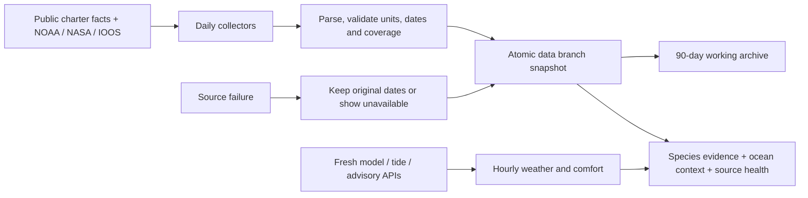

# Bite evidence and the daily data pipeline

Research and implementation review: September 21, 2026.

SkipperCast now refreshes public fishing evidence every day and explains its strength separately from boat comfort. The first useful result is **confidence in recent reported activity**, not an invented percentage chance of catching a fish. Surface ocean observations add context. Neither calm seas nor a warm pixel demonstrates a bite.

## What other fishing products teach us

These are the vendors' descriptions of their products, not independent validation of their predictive accuracy. No paid subscription, proprietary tile, private catch corpus, or commercial algorithm is copied.

| Product | Relevant approach | What SkipperCast can adopt with public data | What remains missing |
| --- | --- | --- | --- |
| [Fishbrain BiteGuide](https://fishbrain.com/features/biteguide) and [BiteTime](https://fishbrain.com/blog/fishbrain/bitetime-is-the-right-time) | Species-oriented forecasts using historical catches and environmental context | Keep species, place, season and observations connected; explain evidence separately from weather | A large, consistently measured local catch/effort dataset and independent calibration. Vendor score scales cannot be reused as evidence. |
| [FishTrack](https://www.fishtrack.com/) | Offshore SST, chlorophyll, currents, weather, tides and imagery | Compare dated water-mass and ocean-color context around offshore search water | Public surface grids do not provide current tuna GPS fixes or resolve every front. |
| [SatFish](https://www.satfish.com/how-to-video-reading-sst-chlorophyll-maps/) | Reading temperature and chlorophyll patterns; [coverage limitations](https://www.satfish.com/frequently-asked-questions/) | Show observation dates and coverage; preserve cloud/reception gaps | Missing pixels cannot be interpreted as unproductive water. Interpolated analyses must be labeled. |
| [FishWeather](https://www.fishweather.com/) | Marine weather and observational context | Keep wind, gusts, swell components and return-window comfort prominent | Weather suitability alone is not a species catch model. |

Solunar calendars, moon phase, pressure and tide stage may be candidate explanatory variables in a future local study. They receive no bite bonus here without out-of-sample evidence. High/low water is not synonymous with slack current.

## Free sources and how they are used

| Source | Collection / application | Important limit |
| --- | --- | --- |
| [SoCalFishReports daily boat totals](https://www.socalfishreports.com/dock_totals/boats.php) | Thirty completed Pacific calendar dates for Morro Bay and Avila landings; boat, species category, count, released flag, anglers, trip type, named ground and source link. Latest seven dates re-read for corrections. | Selected public reports, not all trips. A missing species is unreported, not a measured zero. Published counts do not supply fishing hours or catch coordinates. |
| [NASA JPL MUR SST via NOAA](https://coastwatch.pfeg.noaa.gov/erddap/info/jplMURSST41/index.html) | Daily surface analysis, error standard deviation and land mask. Native 0.01° grid sampled at stride five for a compact regional subset. | Interpolated Level 4 foundation temperature, not a direct observation of each pixel or bottom temperature. Recent fields may be revised. The app reports the nearest actual sampled cell and distance. |
| [NASA Aqua MODIS chlorophyll via NOAA](https://coastwatch.pfeg.noaa.gov/erddap/info/erdMH1chla1day_R2022NRT/index.html) | Latest daily ocean-color composite, approximately 4 km, original valid cells only | Surface phytoplankton proxy, not bait density. Clouds, quality filtering and latency leave gaps. No nearest-valid-cell substitution across gaps. |
| [NOAA IOOS/HFRNet radar currents](https://coastwatch.pfeg.noaa.gov/erddap/info/ucsdHfrW6/index.html) | Latest hourly 6 km vector grid, contributing-radar count and geometric uncertainty indicator | Approximately upper 2.4 m. Require at least two contributing radars; this is not bottom drift. Daily collection means a sample can age out during the day. [CeNCOOS explains the radar network](https://www.cencoos.org/observations/sensor-platforms/hf-radar/). |
| [NDBC Diablo Canyon 46215](https://www.ndbc.noaa.gov/station_page.php?station=46215) and [Cape San Martin 46028](https://www.ndbc.noaa.gov/station_page.php?station=46028) | Dated recent observations; 46215 swell/wind-wave components; source units retained | Missing sensors stay null. The most recent wind reading is not necessarily the most recent wave reading. Observations do not verify future conditions. |
| [NOAA CO-OPS API](https://api.tidesandcurrents.noaa.gov/api/prod/) | Nine UTC dates of Port San Luis high/low predictions, station 9412110, MLLW, feet; separate live app chart remains available | Nearby reference, not Morro Bay bar-current or slack-current predictions. Tide predictions have a prediction horizon, not an observation timestamp. |
| [NWS coastal advisories](https://api.weather.gov/alerts/active/zone/PZZ645) and [offshore advisories](https://api.weather.gov/alerts/active/zone/PZZ670) | Structured active alert facts and provider update/sent/effective times | The daily snapshot is an audit. Browser weather checks again; no old clear-conditions result authorizes departure. |
| [Open-Meteo model API](https://open-meteo.com/en/docs) and [marine API](https://open-meteo.com/en/docs/marine-weather-api) | Archive IFS vs GFS winds and WAM vs GFS Wave seas at five matching samples, including initialization metadata, actual returned coordinates, units and populated arrays | One access service, four explicitly identified underlying models. Generation duration and retrieval time are not issue times. Browser live weather remains independent of this daily context feed. |
| [CDFW groundfish](https://wildlife.ca.gov/Fishing/Ocean/Regulations/Groundfish-Summary), [in-season changes](https://wildlife.ca.gov/Fishing/Ocean/Regulations/Inseason), [salmon](https://wildlife.ca.gov/Fishing/Ocean/Regulations/Salmon), [crab](https://wildlife.ca.gov/Crab), [Buchon MPAs](https://wildlife.ca.gov/Conservation/Marine/MPAs/Point-Buchon), [Cambria MPAs](https://wildlife.ca.gov/Conservation/Marine/MPAs/Cambria-White-Rock) | Verify expected page content and compare normalized-content hashes to the previous run | A detected change requires interpretation. This does not automatically amend legal boundaries, establish a season as open, or certify legal access. |
| [Morro Bay Harbor](https://www.morrobayca.gov/144/Harbor) | Public-page access/change check | Not a live entrance clearance feed. |

The regional satellite/current request spans 34.95–35.70° N, 121.95–120.70° W, covering the app's coastal and offshore forecast samples. These data add no new bottom-fishing grounds and do not change the 200-foot habitat screen.

Metadata inspection found a material latency problem: the inspected S-NPP VIIRS daily chlorophyll catalog ended August 25, while the NOAA-20 catalog ended June 20 despite later metadata creation dates. The selected MODIS daily dataset advertised coverage through September 19; MUR through September 20; HF radar through September 21. These are dated research findings, not permanent freshness guarantees. Every run reads the dataset's actual latest timestamp. Source access failures remain failures even when a catalog can be read through another research tool. The pipeline does not use web-search snippets as numeric data.

## Confidence notes

The app evaluates the **seven completed Pacific calendar dates before today** for the selected species. Those observations do not slide into the future when the weather timeline moves.

- **Moderate:** feed generated within 36 hours; all seven report dates successfully read within 36 hours; at least five positive trip reports from at least two boats on at least three dates.
- **Low:** positive reports exist, but freshness, collection coverage, boat count or date count is weaker.
- **Insufficient:** no positive reports in this collected window. This says nothing definitive about fish absence or legal access.

These are transparent evidence-coverage rules, not estimated confidence intervals. Multiple boats can share a landing and reporting publisher. Moderate is confidence in recent reported regional activity, not in an exact reef, a future feeding window, or your catch probability. No High category is available. `catch_probability` and `bite_score` must remain null; numeric comfort scores stay separate.

Counts are normalized by broad app species category while preserving the reported label. Rockfish categories aggregate different species. Unqualified salmon/halibut labels do not prove species identification. Released fish remain separate. No catch-per-angler or catch-per-hour performance rating is computed: targeting, trip duration, gear, retention limits and unreported unsuccessful trips would confound it.

## What would support a real bite model

The most valuable missing input is **standardized effort including zero catches**. Record every fishing segment, even when nothing bites:

| Input | Why it matters |
| --- | --- |
| Target species and positive identification of catch | Incidental bycatch is not targeted effort; rockfish species have different niches. |
| Start/end time actually fishing, number of anglers/lines, method, bait/lure | Supplies a meaningful effort denominator and distinguishes searching, travel and fishing. |
| Approximate position with accuracy and bottom/fishing depth | Allows habitat matching without pretending a landing port locates fish. Exact personal locations should remain private by default. |
| Kept, released, zero-catch and encounters recorded consistently | Corrects the success-only sample problem; retained counts alone can reflect a bag limit. |
| Sounder fish/bait marks, bait species, water clarity and measured drift | Adds direct local observations missing from surface environmental products. |
| Forecast issue/run and environmental sample times available before the trip | Prevents training on information unavailable when a forecast would have been made. |

Choose a defined outcome first, such as at least one identified target fish per angler-hour under a documented method. Compare against simple season/area baselines; split training and evaluation by future time and separate locations/vessels; include unsuccessful trips; audit selection bias and coverage by species. Report calibration and uncertainty, not just prediction accuracy. A minimum sample count cannot be responsibly selected before defining the target, effect sizes and independent evaluation design.

For bottom species, improve bottom habitat, fish/forage observations and measured drift before giving SST excessive weight. For halibut, soft sediment alone does not measure bait or clarity. For tuna, fronts and prey context are useful search features; [NOAA albacore ecology](https://www.fisheries.noaa.gov/species/pacific-albacore-tuna) supports the temperature/front association, not a guaranteed ideal SST or a school location. Salmon requires legal access and contemporary forage evidence. Dungeness needs crab-specific gear and effort observations; boat rockfish reports are a poor crab dataset.

[CDFW CRFS](https://wildlife.ca.gov/Conservation/Marine/CRFS) and [RecFIN](https://www.recfin.org/about/data-providers/) are valuable structured catch/effort context for seasonal and regional validation. They are not daily reef nowcasts; survey designs and revisions matter. [NOAA explains recreational survey estimates and their limits](https://www.fisheries.noaa.gov/recreational-fishing-data/introduction-marine-recreational-information-program-data). They are researched candidates for an appropriately aggregated historical baseline, not an integrated live feed in this release.

## Architecture and operation



Code lives in [the pipeline package](../src/skippercast/pipeline/collect.py), with independent [parsers](../src/skippercast/pipeline/parsers.py), [frontend evidence logic](../dist/bite-evidence.js) and [daily workflow](../.github/workflows/daily-data.yml). The existing private Telegram monitor is separate and unchanged.

The GitHub job is scheduled for **4:17 a.m. America/Los_Angeles daily**, with daylight saving handled by the workflow timezone. It also runs manually and on collector/workflow changes to main. Source requests have 25-second timeouts, at most one retry, four concurrent government-source tasks and two report-page requests. Reports cover 30 completed dates; seven dates are refreshed to pick up corrections, and older successful facts preserve their retrieval dates. Source schema changes fail the source instead of returning false zeroes.

One atomic push updates the separate `data` branch. `latest.json` and `health.json` contain the most recent run, including partial failure. Previously successful source payloads can be retained, explicitly marked with their original retrieval and observation dates. The working archive retains each UTC day's latest snapshot for 90 days; Git history may retain older commits. No raw commercial report HTML is published. No private catch logs, credential files or personal monitor state enter this branch.

The app reads the public feed at runtime, checks again hourly while visible, and refreshes on return to the tab. Charter-area details also show a separate recent-report note without rewriting the historical audit. If unavailable, it shows the bundled edition with an explicit saved-snapshot label and its original date. After 36 hours the feed cannot earn Moderate evidence. Individual freshness limits are six hours for buoys, twelve for surface radar, 72 for MUR, 96 for daily chlorophyll and 36 for model initialization. These are disclosed product gates, not a scientific guarantee of representativeness. Blank/failed sources do not become calm water or zero fish. Rule-page hashes are change signals only.

Five of seven report days and at least one current buoy source are required for core job health. Optional source failures produce a degraded snapshot and a workflow warning; core failures publish their failure status, then fail the job. If collection or publication itself fails, the previous feed ages visibly. See the [live workflow history](https://github.com/Grahammmm/skippercast/actions/workflows/daily-data.yml) and [compact health feed](https://raw.githubusercontent.com/Grahammmm/skippercast/data/health.json).

[GitHub documents](https://docs.github.com/en/actions/reference/workflows-and-actions/workflow-syntax) the cron/timezone configuration and [schedule behavior](https://docs.github.com/en/actions/reference/workflows-and-actions/events-that-trigger-workflows#schedule), including possible delays and disabling inactive public-repository schedules after 60 days. The schedule is not a delivery SLA. It is independent of the desktop app and uses the repository's scoped Actions token; no new paid service or account secret is needed.

To run locally with Python 3.11 or newer:

```bash
PYTHONPATH=src python -m skippercast.pipeline --output var/daily --previous var/previous.json
PYTHONPATH=src python -m unittest discover -s tests -p 'test_pipeline.py' -v
node --test tests/test_evidence.mjs
```

For a failed run, read the Actions summary and individual source records first. Rerun after transient failures; repair a parser if the publisher's schema changed. Never manually change source dates to make data appear current. If the schedule is disabled, re-enable the existing workflow rather than creating a second collector.

## First cloud run

The [first cloud run](https://github.com/Grahammmm/skippercast/actions/runs/35628034015) succeeded on September 21, 2026 at the collection time 16:49 UTC. It published 77 local trip reports and 49 healthy source checks out of 50, including all seven recent report pages. The MODIS request succeeded but contained zero usable cells in the selected regional subset, so chlorophyll was marked missing rather than zero. MUR returned 343 valid sampled cells and radar currents 207; coverage at each selected point is checked separately. The workflow was verified active. This is an initial execution receipt, not evidence that later scheduled checks already occurred.
