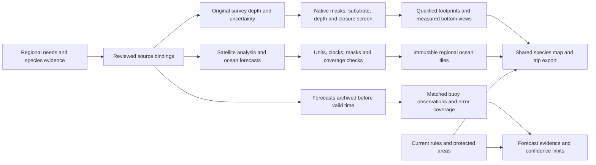

# From regional evidence to a coastal fishing map

SkipperCast now has two complementary mapping paths. Surveyed bottom targets change when reviewed survey or habitat evidence changes. Pelagic water layers change with the chosen forecast time, within the provider's actual horizon. Both retain their source, date, spatial resolution, limitations and publication receipts.



## What this release establishes

- Eleven measured, uncertainty-screened reef patches near Anacapa and eastern Santa Cruz. Their original NOAA surveys have named MLLW reference, 1–4 m eligible native cells and recorded product uncertainty. Their maps and bottom images do not identify individual boulders or verify catches. [Survey method and exact sources](island-target-quality.md).
- Source-resolution regional temperature analysis, temperature gradients, chlorophyll observations and NOAA surface-temperature/current forecasts. The shared date selector changes actual ocean forecast frames; satellite observations retain their original dates. [Dynamic habitat method](dynamic-species-method.md).
- Local forecast verification with station/grid matching, provisional observation quality, unique weather hours, missing coverage and fair model comparisons. Compressed, checksummed shards preserve the prospective archive without a growing single JSON file. [Verification and storage](forecast-verification-quality.md).

The Southern California package remains a preview with partial coverage. Its qualified subset is separately validated; it does not promote the entire coastline to surveyed or export-qualified status. Source-resolution is not the same as independent measurement accuracy. Broad thermal references describe ecological evidence, not a fitted bite curve.

## Repeatable operating process

The existing half-hourly workflow discovers every non-draft region. It refreshes observations, model evidence and verification, then calls the habitat collector. Satellite and regional ocean products use a six-hour cache with original source clocks. The daily workflow continues checking rules, protected-area evidence and source-document access. Survey inputs are immutable and hash-pinned; a new or changed survey requires an explicit source review and rebuild.

```bash
# Inspect what a proposed region can actually support.
PYTHONPATH=src python -m skippercast.platform needs --region southern-california

# Compile original survey inputs in the pinned optional GIS environment.
python -m pip install -r requirements-survey.txt
PYTHONPATH=src python scripts/build_socal_targets.py \
  --config regions/southern-california/bottom-sources.reviewed.json \
  --output dist/regions/southern-california/qualified-bottom --fetch
PYTHONPATH=src python scripts/publish_bottom_subset.py --region southern-california
PYTHONPATH=src python -m skippercast.platform.build

# Run exactly the regional collector used by the shared schedule.
PYTHONPATH=src python scripts/refresh_regions.py habitat \
  --output var/habitat --previous-root var/previous-conditions
```

Use a new reviewed configuration, region ID, target prefix and output directory when applying the survey compiler elsewhere. Its current adapter requires original NOAA variable-resolution BAG files with inspected MLLW metadata; another format or datum requires a reviewed adapter. Do not rename a grid's datum to satisfy the contract.

The source branch holds code and reviewed public packages. The conditions branch holds current operational products and their prospective archive. Tile and archive files are immutable and checksummed. Publication writes data before manifests, then commits the coherent regional snapshot. The outgoing and incoming generations remain available for cached readers. A failed refresh retains source age; a missing or corrupt archive prevents publication rather than silently restarting verification. Expected cloud gaps remain visible without being mislabeled as a transport failure.

## Gate for the next coastline

1. Select a bounded region and jurisdiction; define local species, access notices, forecast points and observation stations. Do not transfer another region's species optimum, regulation card, harbor current or forecast performance.
2. Review actual datasets: geographic footprint, native masks, variables, units, date, depth reference, uncertainty, redistribution rights, endpoint availability and update cadence. A populated but stale satellite product stays a research candidate.
3. Demonstrate a real import with hashes and coverage. For bottom targets, qualify complete footprints and current exclusion geometry. For ocean layers, preserve missing pixels and populated forecast limits. Subdivide requests that exceed the native-cell budget.
4. Run native scientific fixtures, regional contract/tamper checks, browser logic and export tests. Check the new region on a phone and iPad, including slow connections, missing feeds and a seven-day date selection. Mobile visual verification remains a release item whenever browser access is unavailable.
5. Observe a successful scheduled publication. Confirm failure reporting, source age, prior-generation retention, archive restoration and bounded payload sizes. The first day's verification cannot choose the best local model; collect independent future outcomes before calibration.
6. Expand one adjacent package at a time. Statewide readiness requires regional source coverage and operational evidence, not just a coastline-sized bounding box. Persistent archive growth should move to versioned object storage before repository retention becomes costly; the manifest and shard interfaces support that transition.

Do not add atmospheric pressure, fleet activity or another copy of the same satellite feed as independent evidence of fish presence. A future species model needs identified catches **and unsuccessful effort**, fish depth/life stage, held-out dates and areas, calibration and comparison with simple baselines. Existing map ranks remain physical search priorities until that evidence exists.
