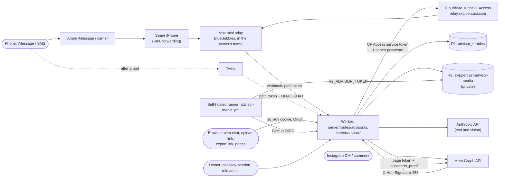

# Threat model

A STRIDE review of SkipperCast as it runs on `main` (after PR #24, [P0-01]), with the fixes in open PRs noted where they change the picture. For each threat: the current mitigation with file references, the risk that remains, and the task from the engineering audit guide that addresses it. Section 9 covers the Text Advisor, reviewed separately from its own code (2026-10-04). This is an engineering document, not legal advice.

**STRIDE:** **S**poofing identity · **T**ampering with data · **R**epudiation (no record of who did what) · **I**nformation disclosure · **D**enial of service · **E**levation of privilege.

**Risk scale:** High (plausible and damaging now) · Medium · Low (unlikely, or limited damage). "Residual" is the risk left after the current mitigation.

## System and trust boundaries

Boundaries: the visitor ↔ the edge; the edge ↔ the Worker (identity headers are trusted only on Sites); the Worker ↔ each store and outbound service; GitHub Actions ↔ Cloudflare (a long-lived API token) and ↔ the Worker (short-lived OIDC); the pipeline ↔ third-party data providers.

Assets, most sensitive first: private records in D1 (owner id, trips, push endpoints and keys, alert text, comfort feedback); credentials (`CLOUDFLARE_API_TOKEN`, `ANTHROPIC_API_KEY`, `WATCHDOG_GITHUB_TOKEN`, VAPID private key); the integrity of published feeds (people plan boat trips on them); availability of the public map; the Anthropic budget.

## 1. Static site and Worker shell

| STRIDE | Threat | Current mitigation | Residual | Planned |
| --- | --- | --- | --- | --- |
| T | A stale or swapped script is served from an edge cache after a deploy | Every script and style is content-hashed by Vite and pages carry the build id (`scripts/client-build.mjs`); page shells are served `no-store` (`server/routes/assets.ts`, `SHELLS`); `scripts/check_client.mjs` checks the Vite manifest and fails on unhashed or unresolved references | Low | |
| T / E | Cross-site scripting through rendered feed or third-party text (recent-discussion links, source names) | A meta CSP on `dist/index.html` with `script-src 'self'`; templates escape with `esc()` helpers (`dist/app.js`, `dist/recent-discussions.js`, others) | Medium: 101 `innerHTML` sites; `connect-src`/`img-src` allow any `https:`; other pages have no CSP; no HSTS or `frame-ancestors` | P0-06 (PR #38/#43: header CSP with enumerated hosts, HSTS, `frame-ancestors 'none'`, SRI on vendor files); P4-01 component model |
| T | A vendored library is modified | SHA-256 of every vendored and binary file in `scripts/web-vendor-sha256.json`, checked by `scripts/check_repository.py` and `scripts/check_web.py` | Low | P0-06 adds `integrity=` attributes |
| D | Heavy anonymous traffic to pages and assets | Static assets served by the platform; Worker only routes | Low | P0-05 rate limits (PR #43) |
| I | Email-derived hosting address published | — (`deployments/production.json`, `README.md`) | Low | P3-07, P5-02 |

## 2. Private API and identity

Routes: `/api/trips`, `/api/events/ack`, `/api/subscription`, `/api/comfort`, `/api/privacy`, `/api/boat/lookup` ([API reference](../engineering/api-reference.md)).

| STRIDE | Threat | Current mitigation | Residual | Planned |
| --- | --- | --- | --- | --- |
| S / E | Forging `oai-authenticated-user-id` to act as any owner (audit finding A1, critical) | `user()` trusts the headers only when `IDENTITY_PROVIDER` is `chatgpt-sites` (`server/worker.js` at the time; now `server/middleware/context.ts`); `wrangler.jsonc` sets `none`, so on Cloudflare every private route is `401`; tests assert the gate and that `wrangler.jsonc` keeps `none` (`tests/test_private_api.mjs`); PR #26's smoke test checks forged headers are refused after each deploy | Low on Cloudflare. On Sites, correctness depends on the platform stripping visitor copies of the headers. The var defaults to `chatgpt-sites` when absent, so a Cloudflare config that loses the `vars` block would reopen A1 (the config test guards the committed file only) | P3-02 (own accounts: Better Auth, `__Host-` cookie) removes header identity entirely |
| T | Cross-site request forgery against mutations | Every non-GET private route requires an `Origin` in `allowed_origins` or `EXTRA_ORIGINS` (`requireOrigin`); JSON bodies only | Low | Keep the Origin check in P3-02 |
| T | Tampering with another owner's rows | Every query binds `owner`; subscription endpoints owned by someone else → `409` | Low | P3-01 Drizzle queries |
| T | Malformed input reaching SQL or the alert engine | Bounded streamed body (8 KiB); strict validators (`validateTrip`, `validateSubscription`, comfort ranges); parameterised statements only | Low: event ids are bound without type checks on `main` | PR #45 (P3-06) validates ids; P3-01 zod schemas |
| R | No record of who changed what | `console.error` with path and error class; Cloudflare `observability` enabled | Medium: no request id, no per-owner audit log (by design no owner ids in logs) | P3-05 (request ids, Analytics Engine, Logpush) |
| I | Private records disclosed | Owner-scoped reads; `Cache-Control: no-store` on every private response; no CORS headers on `/api/*`; export and delete (`/api/privacy`); retention (90 days trips/events, 365 days feedback) | Medium: retention runs only inside `/api/jobs/check`; `/api/health` reveals which secrets and bindings exist | P0-07 (PR #28, prune on cron); PR #45 minimal health; P0-09 privacy notice (PR #36) |
| D | Flooding D1 or the Worker | 30 mutations per owner per minute (`budget`); caps of 20 active trips and 5 devices | Medium: no per-IP limit on anonymous routes on `main` | P0-05 (PR #43) |
| E | A restore or migration resurrects deleted records | — | Medium once real users are on Cloudflare: deletions after a restore point are not replayable (D1 restore runbook, `docs/operations/runbooks/d1-restore.md`, PR #46) | P0-03 (PR #26 backups); a deletion log without personal data |

## 3. Scheduler job authentication (`POST /api/jobs/check`)

| STRIDE | Threat | Current mitigation | Residual | Planned |
| --- | --- | --- | --- | --- |
| S | Someone other than the live workflow triggers trip checks | GitHub OIDC token verified against GitHub's fixed JWKS URL (no `jku`/`x5u` followed); RS256 only; issuer, audience, subject (mutable and immutable forms), repository, repository id, owner id, ref, workflow ref and event pinned to `deployments/production.json`; lifetime ≤ 600 s (`server/job-auth.ts`; `tests/test_job_auth.mjs`) | Low | — |
| S | A pull request or fork runs the production job | `pull_request` events are not accepted; ref must be `refs/heads/main`; fork PRs get no `id-token` | Low | — |
| T / E | A change merged to `main` makes the workflow call the job with altered behaviour | Branch protection and review on `main` (AGENTS.md) | Medium: `live-conditions.yml` holds `contents: write`, `actions: write` and `id-token: write` together | P2-06 (split `feed-live` / `feed-notify` permissions) |
| R | Replay of a captured token | 30 calls per `jti` per minute; events and deliveries are idempotent (stable ids, receipts) | Low | — |
| D | GitHub JWKS unreachable | Fails closed (`401`) | Low: trip checks pause | — |
| I | Token logged | Neither token is logged or written (`scripts/check_saved_trips.py`, `server/job-auth.ts`) | Low | — |

## 4. Push delivery

| STRIDE | Threat | Current mitigation | Residual | Planned |
| --- | --- | --- | --- | --- |
| S / T | Server-side request forgery through a crafted subscription endpoint | HTTPS only, no port or credentials, ≤ 2,000 characters, host allow-list (FCM, Mozilla, Apple, Windows) (`validateSubscription`); `redirect: 'manual'`; 12 s timeout | Low | — |
| S | Sending pushes as SkipperCast with a leaked VAPID private key | Key held as a Sites secret; never in feeds or logs (`docs/production-operations.md`) | Medium if leaked: every subscriber can be messaged (secrets-rotation runbook, `docs/operations/runbooks/secrets-rotation.md`, PR #46) | — |
| I | Push services reading alert text | Payloads encrypted to the device keys by `@block65/webcrypto-web-push` | Low | — |
| D / R | Duplicate or lost alerts | Stable event ids; per-subscription claim rows; only an accepted response marks delivery; `held` deliveries fail the job for reconciliation (`deliver()` in `server/trips.ts`) | Low | P3-04 queues |

## 5. AI boat lookup (`POST /api/boat/lookup`)

| STRIDE | Threat | Current mitigation | Residual | Planned |
| --- | --- | --- | --- | --- |
| D (cost) | Spending the Anthropic budget | Sign-in required; 20 lookups per owner per day; results cached 30 days by query; unavailable on Cloudflare until sign-in exists | Medium: no global ceiling or kill switch; model id hard-coded (A23) | P0-08 (PR #29: global daily cap, `BOAT_LOOKUP_ENABLED`, usage logging) |
| T | Prompt injection from searched web pages yields wrong specifications, cached for everyone who types the same query | Output parsed as one JSON object and bounded by `normalizeBoat` (`dist/boat-handling.js`); sources listed; the person confirms before saving; ratings never rely on it silently | Low–Medium | — |
| I | The boat description is sent to a third party | Only the query string is sent (`server/boat-lookup.ts`) | Low: needs disclosure | P0-09 privacy page (PR #36) |

## 6. Feeds: R2, GitHub branches and the `/feeds/` route

| STRIDE | Threat | Current mitigation | Residual | Planned |
| --- | --- | --- | --- | --- |
| T | Path traversal or reading non-feed files through `/feeds/` | Key allow-list regex, branch allow-list, no `..` (`feedKey` in `server/feeds.ts`; `tests/test_feeds.mjs`) | Low | — |
| T | Publishing false conditions (a compromised job, token or dependency writes the branch or bucket) | Only Actions write the branches; atomic per-cycle commits; R2 pointers uploaded after data files (`scripts/publish_r2.py`); seafloor archives served only with a matching SHA-256 receipt and expiry (`serveFeed`) | Medium: feeds are not signed; any holder of the Cloudflare token or `contents: write` can publish | P2-02 schemas; P2-06 narrower tokens; P0-04 run ids |
| D / I | R2 silently stale while monitoring is green (A6) | Watchdog restarts the live job (`server/watchdog.ts`); hourly freshness check (`scripts/check_feed_freshness.py`) | High on `main`: R2 upload failures are warnings and freshness is read from GitHub only | P0-04 (PR #30: hard failures, public-route freshness, read-back) |
| D | Expensive anonymous reads (up to 15 MB tiles decoded per request) | 5-minute browser cache headers | High on `main` | P0-05 (PR #43: edge cache, per-IP limits) |
| D | R2 errors take feeds down (errors do not fall back to GitHub) | Missing objects fall back to GitHub | Medium | R2 outage runbook (`docs/operations/runbooks/r2-outage.md`, PR #46); P2-05 |
| S | SSRF through feed URLs | Worker reads only URLs compiled into the bundle from reviewed region files (`REGIONS`, `DEPLOYMENT` in `scripts/build-worker.mjs`); `redirect: 'manual'`; 18 s timeout; 15 MB cap | Low | — |

## 7. CI/CD and secrets

| STRIDE | Threat | Current mitigation | Residual | Planned |
| --- | --- | --- | --- | --- |
| E | A compromised dependency or action in a data job steals `CLOUDFLARE_API_TOKEN` (Workers, D1 and R2 edit) and deploys a malicious Worker | Pinned Python requirements and frozen pnpm lockfile; `permissions:` blocks on every workflow; third-party research engine pinned to a commit with `persist-credentials: false` (`daily-data.yml`) | High: one broad token is exposed to five workflows, including ones that run research code; most actions pinned by tag, not SHA | P2-06 (R2-only token for data jobs); P1-05 (PR #41/#42 SHA pins, Dependabot, audits) |
| T | Unreviewed code reaches production | Branch protection on `main`; PR review (AGENTS.md) | Medium: deploy runs on every push to `main` whether CI passed or not (A8) | P0-03 (PR #26: deploy only CI-passed commits, smoke test, rollback) |
| I | Secrets leak into the repository or logs | `scripts/check_repository.py` scans for credential shapes and private paths; secrets passed as env, not arguments; fork PRs get no secrets | Low | P1-05 secret scanning; secrets-rotation runbook (PR #46) |
| R | Who deployed what | GitHub Actions run history; Wrangler deploy messages (after PR #26) | Low | P1-06 release tags (PR #44) |

## 8. Data pipeline sources

| STRIDE | Threat | Current mitigation | Residual | Planned |
| --- | --- | --- | --- | --- |
| S / T | A provider response is spoofed or wrong | HTTPS with verified TLS; public-address check before each request (`check_public_address` in `src/skippercast/pipeline/collect.py`); size limits; per-request receipts with SHA-256; distinct `ok/stale/missing/failed/retained` states; forecast tiles built from NOAA/ECMWF originals | Medium: a well-formed wrong value is published with its source time; DNS can change between the address check and the request (A38) | P2-01 (`skippercast.http.Session` with host allow-list) |
| T | A regulation changes and the app shows the old rule | Hash-bound legal review: a changed or unreviewed source withholds the open-season badge (`pipeline/regulation_review.py`, `platform/build.py`) | Low | — |
| D | Provider outage or rate limiting | Previous good values `retained` with their time; stale labelled; one cycle's failure does not erase the last feed | Medium on `main`: one region's exception stops publication for all regions | P2-04 (PR #34) |
| I | Pipeline leaks private material into public branches | Jobs collect public data only; private seafloor survey state stays outside the repository; `check_repository.py` | Low | — |
| — | Using data the licence does not allow in a paid product | `NOTICE.md`, `docs/data-sources.md` | High commercially (Open-Meteo free tier, GFW CC BY-NC, CSUMB) | P0-10 (PR #33: data-rights register and CI gate) |

## 9. Text Advisor

The Text Advisor ([plan](../plans/text-advisor/README.md)) answers fishing questions by text (iMessage and SMS through a Mac relay, or Twilio), in a web chat and by Instagram DM and comment, takes skippers' catch reports and photos, and publishes approved photos to Instagram and Facebook. This section reviews it as built on the TA branches (2026-10-04, through TA-P1 and TA-C5), from the code, not the plan. Every advisor path answers `404` until `TEXT_ADVISOR_ENABLED=true` (`gate` in `server/advisor/gate.ts`, mounted on every prefix in `ADVISOR_PATHS`, `server/routes/advisor.ts`); production keeps it off until launch ([11 § Launch checklist](../plans/text-advisor/11-testing-rollout.md#launch-checklist-ta-p1)).

Assets, most sensitive first: contacts' phone numbers (stored only as `phone_hash` and `phone_enc`, `server/advisor/contacts.ts`), message transcripts, photos and videos (originals can show faces and, before stripping, locations), Instagram-scoped ids, data exports; the secrets `ADVISOR_PHONE_KEY` (every number's hash and encryption key, and the upload and export token key), `ADVISOR_WEBHOOK_TOKEN`, `BLUEBUBBLES_PASSWORD`, `CF_ACCESS_CLIENT_ID`/`SECRET`, `META_APP_SECRET`, `META_PAGE_TOKEN`, `META_VERIFY_TOKEN`, `TWILIO_AUTH_TOKEN`, `ANTHROPIC_API_KEY`, `R2_ADVISOR_TOKEN`; the integrity of published catch reports, boat pages and social posts; the advisor number's reputation and its Apple Account; the Anthropic budget.

### 9.1 Inbound webhooks

Routes: `POST /api/advisor/inbound/bluebubbles/:token`, `POST /api/advisor/inbound/twilio/:token`, `POST /api/advisor/inbound/twilio-status/:token`, `GET`/`POST /api/advisor/inbound/meta` (`server/routes/advisor.ts`).

| STRIDE | Threat | Current mitigation | Residual | Planned |
| --- | --- | --- | --- | --- |
| S | Forged BlueBubbles deliveries: BlueBubbles signs nothing, so whoever knows the URL can post a "new message" from any number and act as that contact (a skipper's reports, "forget me" then DELETE, the text admin's `ok <code>`) | `ADVISOR_WEBHOOK_TOKEN` in the path, compared in constant time after hashing (`sameSecret`); the per-IP `PUBLIC_LIMITER` (60 a minute, `wrangler.jsonc`) before the check; a refusal logs `advisor_webhook_unauthorized` with no path | Medium: the token is the only control (01 § Security notes named a "Tunnel origin allowlist"; none exists in code: the Mac calls the public Worker URL from the home connection). The path, token included, is in every Workers Logs invocation record (`observability`, `head_sampling_rate: 1`), readable by anyone with log access to the Cloudflare account | Rotate the token with the advisor secrets (§ 9.8). An optional shared-secret header from BlueBubbles, if its webhook settings gain one |
| S | Forged Twilio requests | The same path token, then `X-Twilio-Signature` (HMAC-SHA1 over `ADVISOR_PUBLIC_BASE` + path + sorted form fields, never the Host header) checked with WebCrypto verify, and `AccountSid` must match (`verifiedParams`, `server/advisor/channels/twilio.ts`); body capped at 64 KB | Low. Twilio is not in use until a port ([port to Twilio](../operations/runbooks/advisor-port-to-twilio.md)) | — |
| S | Forged Meta deliveries, or a handshake that subscribes someone else's app | `X-Hub-Signature-256` over the raw body (256 KB cap) checked before parsing (`verifyMetaSignature`, `server/advisor/social/inbox.ts`); the `hub.verify_token` handshake compared in constant time (`equalSecret`); entries for any account but `META_IG_USER_ID` and our own echoes skipped (`parseMetaWebhook`); with `ADVISOR_INBOX_ENABLED` off a signed delivery is acknowledged and nothing stored | Low | — |
| S | A spoofed SMS sender id: the relay trusts the phone number the carrier delivers, and a number is a contact's only identity (skippers, crew, the text admin) | iMessage handles are tied to an Apple Account and are hard to spoof; a new boat is `pending` until the admin verifies it; destructive commands need a second message (`forget me`, then DELETE within 24 h, `FORGET_WINDOW_MS` in `server/advisor/engine.ts`); confirmations and drafts go to the real number, so a spoofer acts blind; the text admin needs a 6-hex-digit review prefix it never saw (`adminFlow`) | Medium: over SMS a spoofer of a verified skipper's number can publish a count text blind (`Y` confirms; with `auto_publish` on, a whole report publishes at once, `server/advisor/intake/reports.ts`), send a count-board photo that the morning Story posts without review (§ 9.8), revoke photo consent, or erase the contact | Owner decision B2 (recommended: `ADVISOR_AUTO_PUBLISH_AFTER=0`, auto-publish off for the pilot); show the admin the channel (iMessage or SMS) of each published report |
| T / D | Oversized or malformed bodies; replays | Bodies capped (BlueBubbles and Twilio 64 KB, Meta 256 KB) and read as streams; provider ids validated; a redelivery is deduplicated on `(channel, provider_id)` by `storeInbound` (`server/advisor/inbound.ts`); dependency errors answer `503` so providers retry | Low | — |
| D | Inbound loss under a burst: the per-IP limit keys every BlueBubbles delivery on the home connection's one address, `updated-message` receipts included | 60 deliveries a minute per IP | Low–Medium: a text flood to the number (or a busy day of receipts) answers `429`, and a BlueBubbles webhook that is refused is not known to be redelivered, so a real message can be lost silently | Measure in the pilot; a separate, higher limit for authenticated webhook deliveries if `advisor_webhook_failed`/`429` lines appear |
| I | The webhook token, the BlueBubbles password or a number in logs | `advisorLog` redacts E.164 and 10-digit runs in every string at any depth (`server/advisor/log.ts`, `tests/test_advisor_privacy.mjs`); webhook, upload and export errors are answered in the route so the shared `onError` (which logs the path) never sees them; the BlueBubbles URL (with `?password=`) is never logged or returned (`server/advisor/channels/bluebubbles.ts`); Analytics Engine points carry route patterns, not paths (`server/analytics.ts`) | Low in our logs; the platform's own invocation logs keep request URLs (row 1) | — |

### 9.2 The Mac relay (BlueBubbles, Cloudflare Tunnel and Access)

Outbound sends and attachment downloads go to `BLUEBUBBLES_URL` (`server/advisor/channels/bluebubbles.ts`) through a named tunnel behind an Access application with a single Service Auth policy ([relay setup § 7](../operations/runbooks/advisor-relay-setup.md#7-expose-bluebubbles-through-a-named-cloudflare-tunnel-with-access)).

| STRIDE | Threat | Current mitigation | Residual | Planned |
| --- | --- | --- | --- | --- |
| S / E | Someone reaches the BlueBubbles API and sends as SkipperCast or reads every conversation | Access answers `302`/`403` without the service token; BlueBubbles' own server password on every call; the URL must be `https` (or localhost for tests); `cloudflared` dials out, so no inbound port is open at home | Low while both secrets hold. The service token is non-expiring by the runbook's default, and the password travels in the query string through Cloudflare's edge | Year-long service token with a reminder (runbook step 7.6 offers it) |
| I | The relay keeps everything: the Mac's Messages database and the iPhone hold every conversation in clear, with photos and videos as received (location metadata included), and Messages in iCloud (turned on in relay setup steps 3.4 and 4.3) copies them to Apple's servers. Retention (`server/advisor/retention.ts`) and FORGET ME (`forgetContact`) reach D1 and R2 only | The Apple Account is dedicated to the relay with two-factor and the owner as recovery contact (relay setup § 2); the machines sit in the owner's home | **High** for the privacy promise: [`/privacy.html#text-advisor`](../../dist/privacy.html) says location details are removed when photos arrive and that erasing removes "all of it at once", but the relay's copies are untouched and kept forever by default | Owner: set Messages → Keep Messages to 30 days on the iPhone and the Mac, decide whether Messages in iCloud is needed, delete a conversation on the relay when a contact sends FORGET ME, and have counsel align the notice (item 17). See § 9.9 |
| T | A malicious attachment or payload from the relay | Attachment GUIDs validated (`^[\w.:;+@-]{1,200}$`), downloads capped at 100 MB and 60 s, types sniffed from bytes, never from the claimed MIME (`sniffMime`, `server/advisor/media.ts`) | Low | — |
| D | Relay down (power, macOS update, Apple sign-out) | Health checks and `advisor_relay_down`; outbound rows held and released oldest first on recovery, failed after 6 hours (01 § As built (TA-C1)); [relay down](../operations/runbooks/advisor-relay-down.md) and [port to Twilio](../operations/runbooks/advisor-port-to-twilio.md) runbooks | Medium: single machine, single home connection | Twilio readiness (owner decision B5) |

### 9.3 Web chat, upload links and data exports

| STRIDE | Threat | Current mitigation | Residual | Planned |
| --- | --- | --- | --- | --- |
| S | Taking over a web visitor's conversation | `sc_adv`: 32 random bytes, `HttpOnly; Secure; SameSite=Lax`, 90 days; only its SHA-256 is stored (`server/advisor/channels/web.ts`) | Low. After the web phone link, the cookie *is* the phone contact for 90 days (its transcript, SEND ME MY DATA and FORGET ME answer in the web chat), so a shared computer shares the contact | — |
| S | Linking a web session to someone else's number | A 6-digit code texted to the number, stored as its SHA-256 for 10 minutes; 5 guesses a day per web contact; the code is bound to the requesting web contact (`server/advisor/tools/offer_text_link.ts`, `linkCodeFlow` in `engine.ts`); an inactive or stopped number is refused | Low: a victim who reads a code out to someone ("If you didn't ask for it, ignore this text") hands over the contact | — |
| T | Cross-site requests to the chat API | `requireOrigin` on `POST /api/advisor/web/message` and `/web/upload` (the private API's allow-list); JSON body capped at 8 KB, 2,000 characters, at most 4 media ids, each an unused stored image of the same visitor | Low | — |
| D / E | **The advisor texts arbitrary numbers on request.** `offer_text_link` sends a code to any US number a web visitor types; `add_crew` invites any number for the owner of any boat, `pending` ones included | 3 codes a day per web contact, the per-IP limit, the per-contact (30) and global (2,000) daily model caps (`engine.ts`); STOP from the recipient is honoured | Medium: a new cookie is a new web contact, so from one address the limits allow dozens of unsolicited texts an hour, up to the global model cap. Recipients' spam reports put the advisor number and its Apple Account at risk (§ 9.9) | A per-recipient daily limit (`phone_hash`) and a global daily limit for link codes and crew invites; crew invites only from verified boats |
| D (cost) | **Exhausting the shared daily model budget from the web chat** | Per-IP 60 requests a minute; per-contact caps | Medium: per-contact caps reset with a new cookie, and the global caps (2,000 model calls, 400 vision calls a day) are shared with the phone channels, so one address can spend the day's budget in under an hour and every skipper then gets the "busy" reply | A separate global sub-cap for web-only contacts, or a per-IP daily model cap |
| S / I | Upload links (`GET /u/:token`, `POST /api/advisor/upload/:token`) used by someone else | `base64url(contact_id\|expiry\|HMAC-SHA256)` with an HKDF subkey of `ADVISOR_PHONE_KEY`, 24 hours, verified statelessly; a bad token is the gate's 404; blocked contacts refused; `noindex`, `no-store`; `Referrer-Policy: strict-origin-when-cross-origin` | Low: a forwarded link lets anyone upload as that contact for 24 hours; the file then follows that contact's normal flow (§ 9.6, § 9.8) | — |
| I | Export links (`GET /api/advisor/export/:token`) | The same signed shape over `contact_id\|key\|expiry`, the key bound to that contact's prefix (`server/advisor/exports.ts`); 24 hours; deleted contact or object → 404; the export omits the number, the session hash and all but 8 hex characters of the phone hash (`exportContact`); objects expire after 7 days (`retention.ts`) | Low: the link (with its token) sits in the recipient's messages and in Workers Logs request URLs for its 24 hours; upload and export tokens share one key without a purpose label (their field counts differ, so neither verifies as the other) | Add a purpose prefix to both MACs when a token format next changes |
| T | A disguised file (HTML or SVG as an image) | Types sniffed from bytes; the web upload accepts images only, 8 MB, checked as it streams (`imageOnly`); the upload link 300 MB; `/media` serves only `image/jpeg`, `image/png`, `video/mp4` with `nosniff` | Low | — |

### 9.4 Media storage and serving (R2 `skippercast-advisor-media`, `/media`)

| STRIDE | Threat | Current mitigation | Residual | Planned |
| --- | --- | --- | --- | --- |
| I | A private photo or video served publicly, or a location leaked through metadata | The bucket has no public access; the Worker never returns an R2 URL. `GET /media/:id.(jpg\|png\|mp4)` serves only `publish_state` `approved` or `posted`; JPEG APPn (except APP0, ICC) and PNG `eXIf`/`tEXt` are dropped at intake and everything after EOI (iPhone MPF) with them; HEIC, GIF, WebP, video and audio originals are never served; a video is served only as the media job's metadata-stripped copy (`server/routes/advisor.ts`, `server/advisor/media.ts`, `scripts/advisor/media_job.py`; `tests/test_advisor_media.mjs`, `tests/test_advisor_video_privacy.mjs`) | Low. Media ids are random; `/media/post/:post/:name` serves only a post's listed graphics in a public status | — |
| I | Originals with metadata reachable by staff | `GET /api/admin/media/:id?v=original` (admin only) | Low | — |
| T / E | The self-hosted runner (in the owner's home) or `R2_ADVISOR_TOKEN` compromised: every original readable and replaceable | The token is scoped to this bucket; the job's Worker endpoints accept only a GitHub OIDC token from `advisor-media.yml` on `main` (`ADVISOR_JOB_SCOPE`, `server/job-auth.ts`), 240 calls a minute per run; derived files carry `source-sha256` | Medium: the runner holds a bucket-wide read/write token | Rotate with the advisor secrets (§ 9.8) |
| D | Storage filled by uploads | Per-IP limit; size caps (8 MB web, 300 MB link, 100 MB relay, 5 MB Twilio); same-contact duplicates share one object; originals expire after 90 days unless referenced (`retention.ts`) | Low | — |

### 9.5 Admin and job endpoints

| STRIDE | Threat | Current mitigation | Residual | Planned |
| --- | --- | --- | --- | --- |
| S / E | A non-admin reaching `/admin.html` or `/api/admin/*` | Passkey session (`requireUser`), then `users.role='admin'` (`requireAdmin`, `server/middleware/admin.ts`); the same 404 for everyone else and while the advisor is off; the role is set only by `scripts/advisor/grant-admin.mjs`; Origin check on every mutation | Low | — |
| S | The text admin fallback (`ok`/`no <6 hex>` from `ADVISOR_ADMIN_CONTACT_ID`) driven by a spoofed number | Only that contact with role `admin-test`, only open skipper and media reviews (`adminFlow`, `applyAdminReview`) | Low–Medium over SMS (§ 9.1 spoofing row): approving a review publishes a photo or verifies a boat | Prefer the admin queue; leave `ADVISOR_ADMIN_CONTACT_ID` unset unless needed |
| R | Who decided a review | `decided_by`/`approved_by` hold the admin's `users.id`; text-admin decisions are noted `text admin` | Low | — |
| S | The media job's endpoints called by anything but the workflow | GitHub OIDC pinned to the repository, `main` and `advisor-media.yml`, audience `/api/advisor/jobs` (`ADVISOR_JOB_SCOPE`, as § 3) | Low | — |

### 9.6 The model: prompt injection, misuse and spend

Untrusted text reaches the model from texts, web chat, Instagram DMs and (with public replies on) comments, plus count-board and fish photos through vision.

| STRIDE | Threat | Current mitigation | Residual | Planned |
| --- | --- | --- | --- | --- |
| E / T | A message makes the model publish, verify, approve or change rules | No tool can: tools are filtered by the contact's role from D1, never from the model (`toolsForRole`, `roles` in `server/advisor/tools/*.ts`); writing tools only propose drafts and reviews; publishing, verification and rules are admin routes; public comment replies get the read-only tools (`COMMENT_TOOLS`); the system prompt treats every message as data and escalates injection attempts (`server/advisor/prompts/system.ts`); golden conversation 7 covers it (`tests/fixtures/advisor/engine/conversations/07-off-topic-abuse-injection.json`) | Low | — |
| T | Injected or misread content in a draft (a caption line, a count read from a board, a fish ID) | Captions come from a forced tool with 120 tokens; count boards become drafts the skipper confirms; social posts are approved by hand, except the morning Stories, which the engine approves for a verified, consenting boat's count board with no hold and for the conditions card (`server/advisor/social/stories.ts`, TA-S5); fish IDs quote the rules table with its source and date; protected species always warn | Low–Medium: an unverified registrant's confirmed report publishes (labelled unverified, "a boat") and feeds port pages and daily answers | — |
| E / T | **Crew added without the member's consent.** Any boat owner, a `pending` (unreviewed) registrant included, can add any active contact that owns no boat as crew: `crew_add` sets the contact's `role='crew'` and `boat_id` at once and ends its crew link to any other boat (`applyCrewAdd`, `server/advisor/consumer.ts`; `add_crew`, `server/advisor/tools/add_crew.ts`). The member's later count boards and photos are then credited to the adding boat | The invite is texted with a STOP line; the owner of a boat cannot be taken; at most 20 crew; an unverified boat's reports show as "a boat" | Medium: knowing a deckhand's number is enough to pull them off a verified boat and collect their reports under another boat, and an angler becomes crew without a word from them | The invitee's YES before the link takes effect (and before any move between boats); crew only for verified boats |
| T | **Self-entered boat details on a public page before review.** `/boats/:slug` renders `pending` boats with their booking link, public phone and Instagram handle (`server/advisor/pages/boat.ts`) | `noindex`, `rel="noopener nofollow"`, an "unverified" badge and note; https links only; HTML escaped; not in the sitemap | Medium: anyone who texts the number can host a link (for example to a phishing page) under `skippercast.com/boats/…` until the admin rejects the boat | Show booking link, phone and handle only once the boat is verified |
| I | Personal data sent to the model provider | Messages, recent turns, briefs (display name, home port, boat) and photos go to Anthropic; numbers never do (only `channels/*.send()` decrypts them); stated in the privacy notice | Low; terms in the [data-rights register](data-rights-register.md#text-advisor-personal-content-and-processors) | — |
| D (cost) | Spend through the model | Per contact 40 messages and 30 model calls a day; globally 2,000 model and 400 vision calls a day (`ADVISOR_DEFAULTS`, `server/advisor/settings.ts`); vision results cached per media row; usage recorded per feature (`recordLlm`) | Medium: see the web-chat row in § 9.3; no Anthropic-side spend limit is recorded in the repository | Owner: set a monthly spend limit on the Anthropic workspace |

### 9.7 Vision providers

| STRIDE | Threat | Current mitigation | Residual | Planned |
| --- | --- | --- | --- | --- |
| I | Photos sent outside Cloudflare | Claude vision only (`server/advisor/vision/claude.ts`) while `HERMES_VISION_URL` is unset; images are the stripped original or the derived `public.jpg` (`visionChain`, `server/advisor/vision/index.ts`) | Low | TA-V2 (in progress) adds the owner's Hermes host behind `HERMES_VISION_URL` and a bearer token (07 § Hermes provider); review this row when it merges |
| T | A wrong classification hides a person or a protected fish | `has_person` holds approval (`approvalHold`); protected species force the must-release warning; thresholds in one place (`decide*`) | Low | — |

### 9.8 Social publishing and Meta tokens

| STRIDE | Threat | Current mitigation | Residual | Planned |
| --- | --- | --- | --- | --- |
| S / T | A stolen `META_PAGE_TOKEN` posts or reads DMs as SkipperCast | Worker and GitHub secrets only; `appsecret_proof` on every Graph call (`server/advisor/social/meta.ts`); never logged (`advisor_meta_error` carries codes only); `tests/test_advisor_social_publish.mjs` checks logs never hold the token | Medium: the Page token does not expire, and the Reels upload host takes it without a proof | Owner: turn on **Require App Secret** in the Meta app's advanced settings if Reels upload still works with it; rotation steps in the secrets runbook |
| T | Posting a photo without consent, or after revocation | A draft only for a consented skipper (`consent_photos_at` with `consent_message_id`) or an angler's yes; revocation rejects every unposted post; `approvalHold` (a person in the photo, an open photo review, an unverified boat, lapsed consent) re-checked at publish; posts approved by hand except the morning Stories (§ 9.6) (`server/advisor/social/drafts.ts`, `publish.ts`, `stories.ts`) | Low: posted items stay on Meta until removed by hand (05 § Consent); a count-board photo from a verified boat's number (or a spoofed one, § 9.1) can become the next morning's Story without an admin decision | — |
| R | Which post went out, when, by whom | `advisor_posts` with `approved_by`, `posted_at`, ids and permalinks | Low | — |
| — | Secret rotation | [secrets-rotation.md](../operations/runbooks/secrets-rotation.md) has no advisor secrets; `ADVISOR_PHONE_KEY` cannot be rotated without re-keying every `phone_hash` and `phone_enc` (and it invalidates live upload and export links) | Medium | Add the advisor secrets to the rotation runbook, with a re-key script for `ADVISOR_PHONE_KEY` |

### 9.9 Risks the owner holds

Engineering cannot remove these; they come with the accounts, hardware and services the advisor depends on.

- **Apple Account suspension.** The advisor's number lives on a consumer Apple Account used for a business service. Spam reports (the unsolicited-text rows in § 9.3), unusual volume or Apple's terms can lock it, and iMessage stops until recovery. Plan: [relay down § When to stop fixing the relay](../operations/runbooks/advisor-relay-down.md#when-to-stop-fixing-the-relay) and the Twilio port. Whether Apple's terms allow this use is in the [data-rights register](data-rights-register.md#text-advisor-personal-content-and-processors) for counsel.
- **Relay hardware in the home.** The Mac and iPhone hold every conversation and original photo in clear (§ 9.2), the BlueBubbles password, the Apple Account session and the `cloudflared` credentials; the self-hosted runner holds `R2_ADVISOR_TOKEN`. Theft, a shared household computer or malware there is a full disclosure. Use FileVault, a separate macOS user, a locked iPhone, and short message retention on both devices.
- **Meta token compromise.** A non-expiring Page token posts and reads DMs as SkipperCast (§ 9.8). Keep two-factor on the Meta accounts and revoke the token from Meta's settings if it leaks.
- **Model misuse and spend.** The caps bound daily use but the web chat can exhaust them (§ 9.3); a leaked `ANTHROPIC_API_KEY` is limited only by the workspace's own limits. Set an Anthropic spend limit and watch the admin funnel's model counts.
- **Cloudflare account access.** Anyone with Workers Logs access sees request URLs, including the webhook token and live upload and export tokens (§ 9.1, § 9.3). Keep account membership minimal.

### 9.10 Text Advisor: top residual risks

1. The relay's Messages history and iCloud copy are outside retention and FORGET ME, against the privacy notice (§ 9.2) — owner settings and counsel.
2. Unsolicited texts to any number through the web phone link and crew invites (§ 9.3) — per-recipient and global limits.
3. The web chat can spend the shared daily model budget (§ 9.3) — a web sub-cap.
4. Crew links made without the member's consent, moving a deckhand between boats (§ 9.6) — the invitee's YES first.
5. Unreviewed boat pages show self-entered links (§ 9.6) — hide until verified.
6. Phone number as identity over SMS, and the path-token-only BlueBubbles webhook (§ 9.1).
7. No rotation procedure for the advisor secrets (§ 9.8).

## Top residual risks

1. Broad `CLOUDFLARE_API_TOKEN` in data workflows (section 7) — P2-06, P1-05.
2. R2 staleness invisible to monitoring (section 6) — PR #30.
3. Uncached, unmetered anonymous endpoints (sections 1, 6) — PR #43.
4. Deploy not gated on CI (section 7) — PR #26.
5. XSS surface and permissive CSP (section 1) — PR #38/#43, P4-01.
6. Header-based identity on Sites until own accounts exist (section 2) — P3-02.

The Text Advisor's list is § 9.10.

## Maintenance

Review this document when a route, a store, a secret or a workflow permission changes, and at least once per release. New findings go into the table of the affected component with a task id, and into the guide's findings ledger if they are new.
