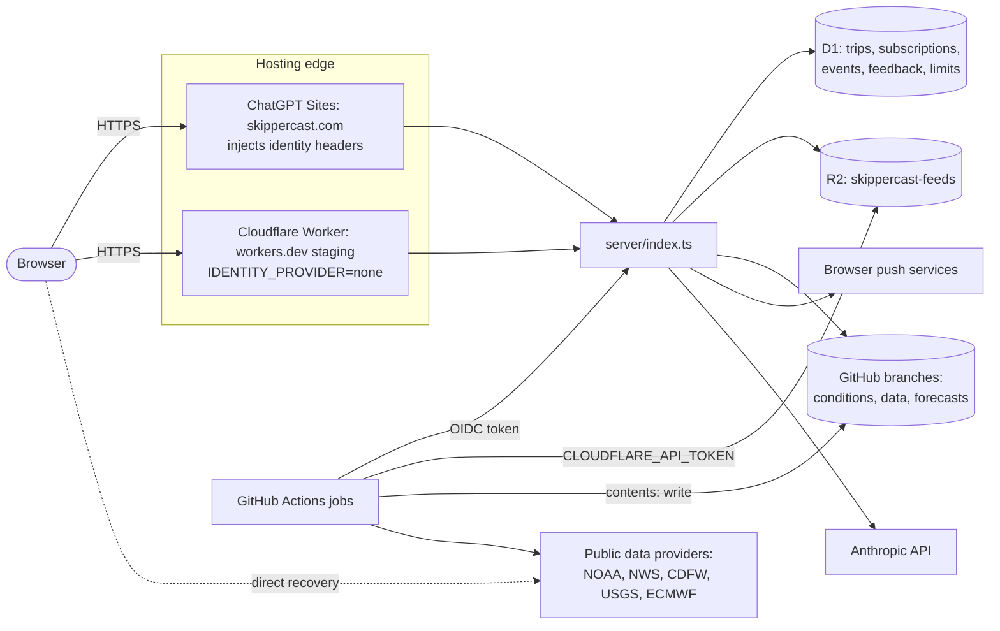

# Threat model

A STRIDE review of SkipperCast as it runs on `main` (after PR #24, [P0-01]), with the fixes in open PRs noted where they change the picture. For each threat: the current mitigation with file references, the risk that remains, and the task from the engineering audit guide that addresses it. This is an engineering document, not legal advice.

**STRIDE:** **S**poofing identity · **T**ampering with data · **R**epudiation (no record of who did what) · **I**nformation disclosure · **D**enial of service · **E**levation of privilege.

**Risk scale:** High (plausible and damaging now) · Medium · Low (unlikely, or limited damage). "Residual" is the risk left after the current mitigation.

## System and trust boundaries

Boundaries: the visitor ↔ the edge; the edge ↔ the Worker (identity headers are trusted only on Sites); the Worker ↔ each store and outbound service; GitHub Actions ↔ Cloudflare (a long-lived API token) and ↔ the Worker (short-lived OIDC); the pipeline ↔ third-party data providers.

Assets, most sensitive first: private records in D1 (owner id, trips, push endpoints and keys, alert text, comfort feedback); credentials (`CLOUDFLARE_API_TOKEN`, `ANTHROPIC_API_KEY`, `WATCHDOG_GITHUB_TOKEN`, VAPID private key); the integrity of published feeds (people plan boat trips on them); availability of the public map; the Anthropic budget.

## 1. Static site and Worker shell

| STRIDE | Threat | Current mitigation | Residual | Planned |
| --- | --- | --- | --- | --- |
| T | A stale or swapped script is served from an edge cache after a deploy | Every script, style and page is content-hashed (`scripts/fingerprint.mjs`); page shells are served `no-store` (`server/routes/assets.ts`, `SHELLS`); `scripts/check_client.mjs` fails on unhashed references | Low | P4-01 moves hashing to Vite |
| T / E | Cross-site scripting through rendered feed or third-party text (recent-discussion links, source names) | A meta CSP on `dist/index.html` with `script-src 'self'`; templates escape with `esc()` helpers (`dist/app.js`, `dist/recent-discussions.js`, others) | Medium: 101 `innerHTML` sites; `connect-src`/`img-src` allow any `https:`; other pages have no CSP; no HSTS or `frame-ancestors` | P0-06 (PR #38/#43: header CSP with enumerated hosts, HSTS, `frame-ancestors 'none'`, SRI on vendor files); P4-01 component model |
| T | A vendored library is modified | SHA-256 of every vendored and binary file in `scripts/web-vendor-sha256.json`, checked by `scripts/check_repository.py` and `scripts/check_web.py` | Low | P0-06 adds `integrity=` attributes |
| D | Heavy anonymous traffic to pages and assets | Static assets served by the platform; Worker only routes | Low | P0-05 rate limits (PR #43) |
| I | Email-derived hosting address published | — (`deployments/production.json`, `README.md`) | Low | P3-07, P5-02 |

## 2. Private API and identity

Routes: `/api/trips`, `/api/events/ack`, `/api/subscription`, `/api/comfort`, `/api/privacy`, `/api/boat/lookup` ([API reference](../engineering/api-reference.md)).

| STRIDE | Threat | Current mitigation | Residual | Planned |
| --- | --- | --- | --- | --- |
| S / E | Forging `oai-authenticated-user-id` to act as any owner (audit finding A1, critical) | `user()` trusts the headers only when `IDENTITY_PROVIDER` is `chatgpt-sites` (`server/worker.js` at the time; now `server/middleware/context.ts`); `wrangler.jsonc` sets `none`, so on Cloudflare every private route is `401`; tests assert the gate and that `wrangler.jsonc` keeps `none` (`tests/test_private_api.mjs`); PR #26's smoke test checks forged headers are refused after each deploy | Low on Cloudflare. On Sites, correctness depends on the platform stripping visitor copies of the headers. The var defaults to `chatgpt-sites` when absent, so a Cloudflare config that loses the `vars` block would reopen A1 (the config test guards the committed file only) | P3-02 (own accounts: Better Auth, `__Host-` cookie) removes header identity entirely |
| T | Cross-site request forgery against mutations | Every non-GET private route requires an `Origin` in `allowed_origins` or `EXTRA_ORIGINS` (`requireOrigin`); JSON bodies only | Low | Keep the Origin check in P3-02 |
| T | Tampering with another owner's rows | Every query binds `owner`; subscription endpoints owned by someone else → `409` | Low | P3-01 Drizzle queries |
| T | Malformed input reaching SQL or the alert engine | Bounded streamed body (8 KiB); strict validators (`validateTrip`, `validateSubscription`, comfort ranges); parameterised statements only | Low: event ids are bound without type checks on `main` | PR #45 (P3-06) validates ids; P3-01 zod schemas |
| R | No record of who changed what | `console.error` with path and error class; Cloudflare `observability` enabled | Medium: no request id, no per-owner audit log (by design no owner ids in logs) | P3-05 (request ids, Analytics Engine, Logpush) |
| I | Private records disclosed | Owner-scoped reads; `Cache-Control: no-store` on every private response; no CORS headers on `/api/*`; export and delete (`/api/privacy`); retention (90 days trips/events, 365 days feedback) | Medium: retention runs only inside `/api/jobs/check`; `/api/health` reveals which secrets and bindings exist | P0-07 (PR #28, prune on cron); PR #45 minimal health; P0-09 privacy notice (PR #36) |
| D | Flooding D1 or the Worker | 30 mutations per owner per minute (`budget`); caps of 20 active trips and 5 devices | Medium: no per-IP limit on anonymous routes on `main` | P0-05 (PR #43) |
| E | A restore or migration resurrects deleted records | — | Medium once real users are on Cloudflare: deletions after a restore point are not replayable (D1 restore runbook, `docs/operations/runbooks/d1-restore.md`, PR #46) | P0-03 (PR #26 backups); a deletion log without personal data |

## 3. Scheduler job authentication (`POST /api/jobs/check`)

| STRIDE | Threat | Current mitigation | Residual | Planned |
| --- | --- | --- | --- | --- |
| S | Someone other than the live workflow triggers trip checks | GitHub OIDC token verified against GitHub's fixed JWKS URL (no `jku`/`x5u` followed); RS256 only; issuer, audience, subject (mutable and immutable forms), repository, repository id, owner id, ref, workflow ref and event pinned to `deployments/production.json`; lifetime ≤ 600 s (`server/job-auth.ts`; `tests/test_job_auth.mjs`) | Low | — |
| S | A pull request or fork runs the production job | `pull_request` events are not accepted; ref must be `refs/heads/main`; fork PRs get no `id-token` | Low | — |
| T / E | A change merged to `main` makes the workflow call the job with altered behaviour | Branch protection and review on `main` (AGENTS.md) | Medium: `live-conditions.yml` holds `contents: write`, `actions: write` and `id-token: write` together | P2-06 (split `feed-live` / `feed-notify` permissions) |
| R | Replay of a captured token | 30 calls per `jti` per minute; events and deliveries are idempotent (stable ids, receipts) | Low | — |
| D | GitHub JWKS unreachable | Fails closed (`401`) | Low: trip checks pause | — |
| I | Token logged | Neither token is logged or written (`scripts/check_saved_trips.py`, `server/job-auth.ts`) | Low | — |

## 4. Push delivery

| STRIDE | Threat | Current mitigation | Residual | Planned |
| --- | --- | --- | --- | --- |
| S / T | Server-side request forgery through a crafted subscription endpoint | HTTPS only, no port or credentials, ≤ 2,000 characters, host allow-list (FCM, Mozilla, Apple, Windows) (`validateSubscription`); `redirect: 'manual'`; 12 s timeout | Low | — |
| S | Sending pushes as SkipperCast with a leaked VAPID private key | Key held as a Sites secret; never in feeds or logs (`docs/production-operations.md`) | Medium if leaked: every subscriber can be messaged (secrets-rotation runbook, `docs/operations/runbooks/secrets-rotation.md`, PR #46) | — |
| I | Push services reading alert text | Payloads encrypted to the device keys by `@block65/webcrypto-web-push` | Low | — |
| D / R | Duplicate or lost alerts | Stable event ids; per-subscription claim rows; only an accepted response marks delivery; `held` deliveries fail the job for reconciliation (`deliver()` in `server/trips.ts`) | Low | P3-04 queues |

## 5. AI boat lookup (`POST /api/boat/lookup`)

| STRIDE | Threat | Current mitigation | Residual | Planned |
| --- | --- | --- | --- | --- |
| D (cost) | Spending the Anthropic budget | Sign-in required; 20 lookups per owner per day; results cached 30 days by query; unavailable on Cloudflare until sign-in exists | Medium: no global ceiling or kill switch; model id hard-coded (A23) | P0-08 (PR #29: global daily cap, `BOAT_LOOKUP_ENABLED`, usage logging) |
| T | Prompt injection from searched web pages yields wrong specifications, cached for everyone who types the same query | Output parsed as one JSON object and bounded by `normalizeBoat` (`dist/boat-handling.js`); sources listed; the person confirms before saving; ratings never rely on it silently | Low–Medium | — |
| I | The boat description is sent to a third party | Only the query string is sent (`server/boat-lookup.ts`) | Low: needs disclosure | P0-09 privacy page (PR #36) |

## 6. Feeds: R2, GitHub branches and the `/feeds/` route

| STRIDE | Threat | Current mitigation | Residual | Planned |
| --- | --- | --- | --- | --- |
| T | Path traversal or reading non-feed files through `/feeds/` | Key allow-list regex, branch allow-list, no `..` (`feedKey` in `server/feeds.ts`; `tests/test_feeds.mjs`) | Low | — |
| T | Publishing false conditions (a compromised job, token or dependency writes the branch or bucket) | Only Actions write the branches; atomic per-cycle commits; R2 pointers uploaded after data files (`scripts/publish_r2.py`); seafloor archives served only with a matching SHA-256 receipt and expiry (`serveFeed`) | Medium: feeds are not signed; any holder of the Cloudflare token or `contents: write` can publish | P2-02 schemas; P2-06 narrower tokens; P0-04 run ids |
| D / I | R2 silently stale while monitoring is green (A6) | Watchdog restarts the live job (`server/watchdog.ts`); hourly freshness check (`scripts/check_feed_freshness.py`) | High on `main`: R2 upload failures are warnings and freshness is read from GitHub only | P0-04 (PR #30: hard failures, public-route freshness, read-back) |
| D | Expensive anonymous reads (up to 15 MB tiles decoded per request) | 5-minute browser cache headers | High on `main` | P0-05 (PR #43: edge cache, per-IP limits) |
| D | R2 errors take feeds down (errors do not fall back to GitHub) | Missing objects fall back to GitHub | Medium | R2 outage runbook (`docs/operations/runbooks/r2-outage.md`, PR #46); P2-05 |
| S | SSRF through feed URLs | Worker reads only URLs compiled into the bundle from reviewed region files (`REGIONS`, `DEPLOYMENT` in `scripts/build-worker.mjs`); `redirect: 'manual'`; 18 s timeout; 15 MB cap | Low | — |

## 7. CI/CD and secrets

| STRIDE | Threat | Current mitigation | Residual | Planned |
| --- | --- | --- | --- | --- |
| E | A compromised dependency or action in a data job steals `CLOUDFLARE_API_TOKEN` (Workers, D1 and R2 edit) and deploys a malicious Worker | Pinned Python requirements and frozen pnpm lockfile; `permissions:` blocks on every workflow; third-party research engine pinned to a commit with `persist-credentials: false` (`daily-data.yml`) | High: one broad token is exposed to five workflows, including ones that run research code; most actions pinned by tag, not SHA | P2-06 (R2-only token for data jobs); P1-05 (PR #41/#42 SHA pins, Dependabot, audits) |
| T | Unreviewed code reaches production | Branch protection on `main`; PR review (AGENTS.md) | Medium: deploy runs on every push to `main` whether CI passed or not (A8) | P0-03 (PR #26: deploy only CI-passed commits, smoke test, rollback) |
| I | Secrets leak into the repository or logs | `scripts/check_repository.py` scans for credential shapes and private paths; secrets passed as env, not arguments; fork PRs get no secrets | Low | P1-05 secret scanning; secrets-rotation runbook (PR #46) |
| R | Who deployed what | GitHub Actions run history; Wrangler deploy messages (after PR #26) | Low | P1-06 release tags (PR #44) |

## 8. Data pipeline sources

| STRIDE | Threat | Current mitigation | Residual | Planned |
| --- | --- | --- | --- | --- |
| S / T | A provider response is spoofed or wrong | HTTPS with verified TLS; public-address check before each request (`check_public_address` in `src/skippercast/pipeline/collect.py`); size limits; per-request receipts with SHA-256; distinct `ok/stale/missing/failed/retained` states; forecast tiles built from NOAA/ECMWF originals | Medium: a well-formed wrong value is published with its source time; DNS can change between the address check and the request (A38) | P2-01 (`skippercast.http.Session` with host allow-list) |
| T | A regulation changes and the app shows the old rule | Hash-bound legal review: a changed or unreviewed source withholds the open-season badge (`pipeline/regulation_review.py`, `platform/build.py`) | Low | — |
| D | Provider outage or rate limiting | Previous good values `retained` with their time; stale labelled; one cycle's failure does not erase the last feed | Medium on `main`: one region's exception stops publication for all regions | P2-04 (PR #34) |
| I | Pipeline leaks private material into public branches | Jobs collect public data only; private seafloor survey state stays outside the repository; `check_repository.py` | Low | — |
| — | Using data the licence does not allow in a paid product | `NOTICE.md`, `docs/data-sources.md` | High commercially (Open-Meteo free tier, GFW CC BY-NC, CSUMB) | P0-10 (PR #33: data-rights register and CI gate) |

## Top residual risks

1. Broad `CLOUDFLARE_API_TOKEN` in data workflows (section 7) — P2-06, P1-05.
2. R2 staleness invisible to monitoring (section 6) — PR #30.
3. Uncached, unmetered anonymous endpoints (sections 1, 6) — PR #43.
4. Deploy not gated on CI (section 7) — PR #26.
5. XSS surface and permissive CSP (section 1) — PR #38/#43, P4-01.
6. Header-based identity on Sites until own accounts exist (section 2) — P3-02.

## Maintenance

Review this document when a route, a store, a secret or a workflow permission changes, and at least once per release. New findings go into the table of the affected component with a task id, and into the guide's findings ledger if they are new.
