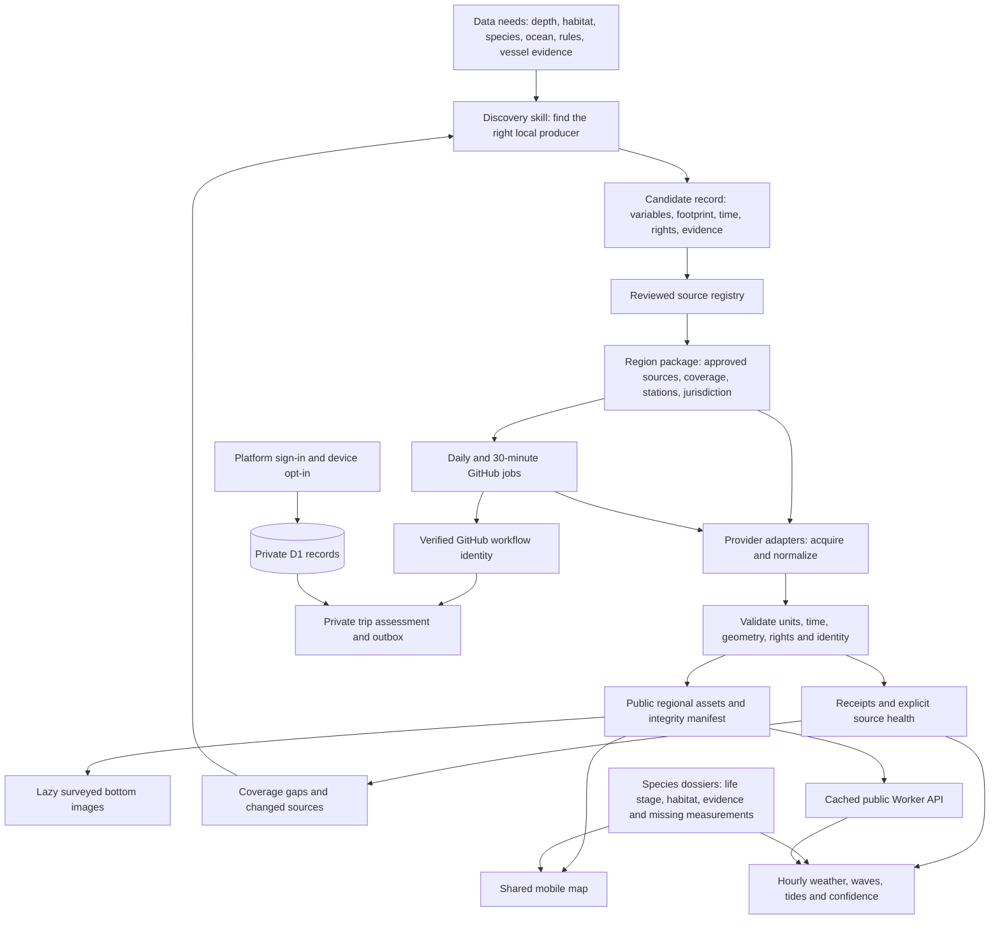

# A reusable coastal fishing system

SkipperCast combines a small shared web app with reviewed regional data packages. Users choose a species, inspect qualified habitat or clearly labeled context, and compare hourly ocean conditions. Each claim retains the limits of its evidence.

The same need can use different sources on different coastlines. For example, Morro Bay's measured bottom views use USGS 2 m grids. The San Simeon preview uses a different USGS geological release for broad context while native-depth target qualification remains incomplete. Both use the same contracts and UI; they do not imply equivalent precision.

Start with [data contracts](data-contracts.md), [regional rollout](regions.md), [surveyed bottom views](seabed-views.md), and [production operations](production-operations.md). Source-backed ecological notes are maintained in `catalog/species.json`; the longer research discussion is in [species research](species-research.md).

The installed skills make discovery, ingestion and rollout repeatable. They produce reviewable candidates and receipts, not automatic trust. Current catch probabilities and verified charter hotspots remain unsupported where the required effort, identity and visit evidence are missing. A smoother sea-state score cannot supply that missing biological evidence.

The [regional intelligence process](regional-intelligence.md) adds actual ensembles, observed/model currents, prospective verification, scoped ecological methods, selected-set exports and private trip alerts. Private records live in D1, never in public feeds.
