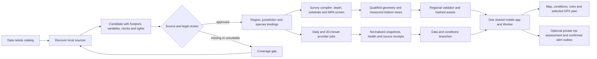

# Region rollout and data flow

SkipperCast is one shared application with regional configuration and evidence packages. Adding a coast does **not** require a copy of the UI or a new scheduler. A published map feature is a reviewed claim with a geographic footprint, source, date, uncertainty, rights and a permitted use. Missing coverage remains visible.

The [statewide buildout ledger](statewide-buildout.md) partitions California into 19 discovery sectors and records the first NOAA survey-catalog scan. It is a work queue for packages, not a statewide fishing-ground map.

## What is already standardized

| Stage | Contract or implementation | Cadence / gate |
| --- | --- | --- |
| Define the need | `catalog/data-needs.json` and `catalog/targets.json` | Reused for every region; no provider selected yet. |
| Discover | `$skippercast-discover-data`, `catalog/source-candidate.schema.json`, `catalog/sources.json` | Candidate records may name a reviewed discovery sector before a detailed region exists. They stay unpublished until footprint, access and rights review. |
| Bind a region | `regions/<id>/region.json`, `jurisdictions/`, `catalog/ecology/`, `catalog/primary-strategies.json` | Stable ID, bounds, harbor, stations, forecast points, species, sources and coverage. Each offered target needs rules and a starter strategy. |
| Ingest and qualify | `$skippercast-ingest-data`, `src/skippercast/pipeline/`, `src/skippercast/platform/`, survey compilers | Raw receipt; original clocks, units, datum, native masks, geometry, provenance and failure state. Fishing targets require full-footprint depth and closure checks. |
| Build | `python -m skippercast.platform.build`, `scripts/build_primary_strategies.py`, `scripts/check_web.py`, `pnpm build` | Compiles region assets and shared Worker; validation fails on missing contracts. |
| Refresh | `.github/workflows/daily-data.yml` and `live-conditions.yml` through `scripts/refresh_regions.py` | Daily rules/source/report checks and roughly 30-minute live conditions. Both discover every non-draft region; no new region-specific cron job. |
| Rehearse a draft | `scripts/refresh_regions.py --only-region <id> --include-drafts` or `.github/workflows/draft-region-rehearsal.yml` | Runs the normal daily collector for each reviewed draft in an unpublished `var/` receipt. Source failures and unchanged legal fingerprints are inspectable before a status change; it cannot publish a site feed. |
| Publish and use | Versioned static region assets, `data` and `conditions` Git branches, cached Worker API, shared mobile UI | Site deployment and feed publication are separate. The app shows source age, missing cells and confidence; exports remain subject to MPA screens. |
| Operate | `docs/production-operations.md`, workflow summaries, `/api/health` | Inspect first successful regional receipts, stale feeds and recovery; roll back a coherent release if necessary. |

The half-hourly job collects the distinct **ECMWF IFS and NOAA GFS** wind forecasts, **ECMWF WAM and NOAA GFS Wave** sea forecasts, NOAA GEFS wind members and wave exceedance products, available buoy/weather observations, NOAA/IOOS surface radar currents, and NOAA WCOFS surface-current forecasts. Open-Meteo is an access service for several products, not another independent forecast model. The daily job checks official rules and notices, source access, dated public reports and recent discussion *leads*. Changed legal text requires hash-bound review; a discussion lead cannot automatically become a hotspot. Dynamic surface-water tiles use dated NOAA Geo-Polar Blended SST, NOAA merged VIIRS chlorophyll where populated, and WCOFS forecast frames. Actual variables, stations, grid positions and horizons are region-specific and retained in receipts. See [regional intelligence](regional-intelligence.md), [dynamic species method](dynamic-species-method.md) and [regulations](regulations.md).

**Forecast models and AI models are different things.** The scheduled collectors, normalizers, scoring rules, validation, MPA screens, manifests and alerts run as code with **no LLM calls**. A small/fast assistant can run the discovery and rollout skills to find candidates, summarize source metadata, prepare regional bindings and write review notes. It must not invent coverage or approve legal changes. Novel provider formats, ambiguous rights, conflicting regulations, scientific method changes and release blockers go to deliberate expert review; a stronger model is optional for that bounded review, not a dependency of the normal refresh. No existing GitHub Action silently invokes Astra or any other LLM.

## Exact rollout sequence

1. Choose a bounded coastline and management jurisdictions. Define target species, fishing methods, depth and harbor assumptions in the region contract. A coast directory entry is only navigation; a detailed package requires its own evidence.
2. Run `PYTHONPATH=src python -m skippercast.platform needs --region <id>`. Use `$skippercast-discover-data` to find primary sources for each gap, then validate candidate records and rights. Bind only reviewed sources whose actual footprint covers the requested area.
3. Follow `$skippercast-ingest-data`. Preserve source and retrieval clocks separately, verify native units and masks, and keep unavailable fields null. Surveyed bottom targets need qualified depth, substrate, uncertainty where required, and current full-geometry MPA exclusions. Pelagic layers remain dated physical context, not a fish-location prediction.
4. Review species ecology and each local regulation card. Add every offered target to `catalog/primary-strategies.json`, run `python scripts/build_primary_strategies.py`, and inspect the resulting `dist/regions/<id>/strategies.json`. A shared target may have regional differences only when its evidence supports them.
5. Run region validation, scientific fixtures, JavaScript tests, web checks and Worker build. Inspect the map and a selected target on a phone. Test absent, stale and failed feeds as well as a populated one. Keep unsupported capabilities in preview.
6. Publish the code/package, then observe a real daily and half-hourly receipt for the new region. Confirm region identity, source age, legal gate, current MPA screen, app selector, forecast, rules, bottom views and GPX export before calling the rollout ready.

Before step 5, rehearse a draft with `PYTHONPATH=src python scripts/refresh_regions.py daily --output var/draft-rehearsal/<id> --only-region <id> --include-drafts`. A local source outage is recorded as such, not reclassified as a legal change. The **Draft region evidence rehearsal** GitHub Action runs the same collector for the currently bound San Francisco and Mendocino drafts after relevant source changes or on manual dispatch. It uploads short-lived per-region artifacts without updating the public `data` branch; a missing critical feed, changed rule or provider fetch failure fails the job visibly. An honest no-coverage cell result remains a gap in the artifact, not a fabricated zero-current observation. Add another draft or preview to the workflow matrix once its exact footprint and species have a hash-bound legal review. A passing source fetch alone does not approve unreviewed rules.

The installed `$skippercast-add-region` skill is the operational checklist. The [data contracts](data-contracts.md) define the reusable types; [regional setup](regions.md) has commands; [quality gates](data-quality-rollout.md) explain where a partial package must stop. A source registered in the catalog is not proof that it covers a new coast, and a forecast or habitat score is not a measured catch probability.

For statewide seabed expansion, the NOAA footprint collector identifies intersecting survey IDs, while the separate original-product audit identifies linked BAG and descriptive-report files. Neither qualifies bottom. The reusable USGS classified-raster adapter accepts a hash-pinned local map block and publishes generalized, non-exportable context geometry. A regional target still needs native depth, substrate, rights, current closures and reviewed species rules for its full footprint; see [California buildout ledger](statewide-buildout.md).

Where a region has an original-cell habitat layer, a matching per-outline native-depth receipt and a complete bounded 18-layer ENC screen, `scripts/triage_original_habitat_outlines.py` can build a **site-review queue**. Add a region-specific entry to `catalog/original-habitat-triage-profiles.json` with expected survey and receipt identity, counts, danger buffer and physical thresholds; refresh the ENC receipt before each run. This narrows human chart, route and legal review without making a catch prediction or publishing a fishing mark. The Cape Mendocino profile is the first binding; another region must provide its own three matching inputs and review thresholds.

The monthly original-hard-context job then refreshes the complete statewide CDFW MPA geometry and NOAA West Coast federal-area layers, and `scripts/audit_habitat_shortlist_closures.py` measures every shortlisted outline's distance to both mapped boundaries. It fails closed on a stale or incomplete source and writes an unpublished, source-hashed review receipt. The [dated September 25, 2026 receipt](../dist/data/cape-mendocino-fresh-closure-audit.json) found that all 32 Cape Mendocino research outlines cleared the 100 m *mapped closure* buffer; the closest was 1,886.8 m from a CDFW MPA. This is one source screen, not a legal interpretation, route clearance or fishing target. NOAA's GIS polygons are approximate and the current regulation text controls. A new region can use the same audit after binding its own original-cell context and review queue; the projection and source-scope parameters must be reviewed for its geography.

The 2026 USGS Cal DIG I v2 audit adds an explicit **source-level depth triage** before polygon promotion: it scans every valid native depth cell and reports how many could even fall within 200 or 300 ft. Its 373,920 habitat polygons have no qualifying shallow-depth cells, so their research value does not create shallow fishing targets. Apply the same native-depth test to future large habitat releases before spending review time on species scores or map exports.
