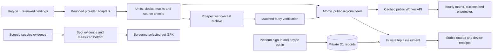

# Regional forecast and fishing intelligence

The selected product-review items use one regional process. See the [implementation ledger](implementation-2026-09.md) and [operations guide](production-operations.md).



One UTC clock drives hourly comparison and map conditions. Regional timezones format it. Trip-date regulations use the selected local calendar date while legal-source freshness uses the actual current time. Missing values remain unavailable; changing a date cannot make an old source fresh.

## Source semantics

| Product | Provenance and limits |
|---|---|
| Wind uncertainty | Actual 31-member NOAA GEFS via [Open-Meteo](https://open-meteo.com/en/docs/ensemble-api). Native three-hour output is provider-interpolated to hourly. Member ranges/counts and raw threshold fractions are not calibrated odds. |
| Wave uncertainty | [NOAA GEFS Wave](https://www.nco.ncep.noaa.gov/pmb/products/gens/gefs.wave.t00z.prob.global.0p25.f000.grib2.shtml) exceedance fields. Displayed threshold: 1 m = 3.28 ft, not 3 ft. Preserve actual three-hour snapshots and returned sea-cell coordinates/distance. |
| Observed currents | [NOAA/IOOS HFR](https://dods.ndbc.noaa.gov/thredds/catalog/hfradar.html), separately at 1 and 6 km. Check masks, contributing sites and geometry. Empty cells remain blank; observations are not moved into future hours. |
| Regional currents | [NOAA WCOFS](https://tidesandcurrents.noaa.gov/ofs/wcofs/wcofs_info.html): approximately 4 km, NAD83, surface layer, actual populated horizon up to 72 hours. Radar assimilation means the two are not independent validation. Neither supplies bottom/bar currents. |
| Wave energy | Matched NDBC frequency-density and mean-direction bins. Brightness shows energy density by period and incoming direction, not full directional spreading. It remains an observation while browsing future hours. |
| Forecast verification | Forecasts acquired before valid time matched to observations within 30 minutes, separated by model, station, variable and lead bucket. Polling does not duplicate samples. At least 30 matches over 7 days enables descriptive reporting; no automatic correction. Buoy-height wind remains an unadjusted comparison to a 10 m forecast. |

The first real collection obtained all Morro Bay products. The northern sample had no valid 1 km HFR cells; its 6 km observations and regional forecast were available. This is dated evidence, not a permanent availability guarantee.

## Reuse in another region

Configure `intelligence.providers`, station metadata, comfort preferences, forecast points and `ecology_profile` in `regions/<id>/region.json`. Contracts require approved source bindings. Reuse current adapters only within their actual coverage. A different regional ocean model needs a new adapter and tests, not a renamed WCOFS source. Unknown provider selections are rejected.

`catalog/ecology/<profile>.json` contains methods, life stage, evidence gaps and geographic/jurisdiction scope. It references primary agency dossiers in `catalog/species.json`. The compiler rejects transfers beyond reviewed scope. Terrain, ecology, actual fish observations and AIS stay separate. Camera candidates remain unverified until a local, licensed, dated sample is attached. This release adds no claimed fish detections or calibrated bite probabilities.

Install `requirements-ocean.txt`, then run:

```bash
PYTHONPATH=src python scripts/refresh_regions.py intelligence --output var/conditions --previous-root var/previous-conditions
PYTHONPATH=src python -m skippercast.platform.build
PYTHONPATH=src python -m unittest discover -s tests
pnpm install --frozen-lockfile
node --test tests/test_*.mjs
python scripts/check_web.py
python scripts/check_repository.py
pnpm build
```

The existing live workflow publishes updates. Preserve `verification-state.json`, `verification-state.previous.json` and the referenced `verification-archive/` shards from the previous conditions branch. Missing or corrupt referenced shards fail collection; they never silently restart the archive. Legacy unsharded state is migrated without thinning. See [verification quality and storage](forecast-verification-quality.md). Environmental products contain no personal records. A new deployment changes its origin, GitHub identity policy, Sites runtime keys and D1 binding; it does not copy Telegram credentials.

## On the map and in iNavX

Spot cards separate mapped evidence, interpretation and unknowns, followed by species-specific methods. The seabed explorer rotates measured elevations, highlights a depth band and shows a nearest-cell cross-section with a separately scaled depth axis. Gaps remain blank; relief is not a boulder inventory or fish finder.

Add spots to an iNavX set, review it, then share/download GPX. Stable point IDs, source notes and WGS84 coordinates accompany deduplicated outline and drift track segments, including holes. Every point and full associated geometry must pass the current MPA screen. Confirm names, coordinates and tracks inside iNavX; downloading is not proof of import. [Official iNavX FAQ](https://www.inavx.com/faq).
