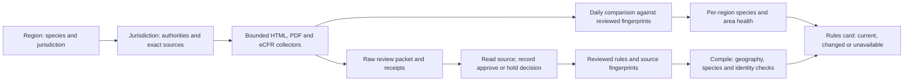

# Regional regulations

The compact Rules card follows the selected forecast date and time, or a date chosen in the card. It shows season status, daily and possession limits, size, method, sublimits and direct official links. Lingcod and rockfish share a selector but retain separate legal limits. An opening with a start time is never treated as an all-day opening.

Each region binds one jurisdiction in `jurisdictions/<id>.json`. Morro Bay–Avila and Cambria–San Simeon share California Central; Southern California uses its own management area and species records. The September 22, 2026 review covers the remainder of 2026. The registry expires after December 31 even where a described season extends into 2027. Future openers requiring review remain unconfirmed.

Season, gear and local access are separate. The Southern card includes Channel Islands park rules, Anacapa and San Miguel special closures, Catalina exceptions, military island access and mainland naval restrictions. Official legal text is checked; live Navy clearance is not. The map conservatively excludes mapped MPAs and groundfish exclusion areas. It does not dynamically apply every date-dependent RCA boundary or operational closure. Habitat outlines are not clearance to fish there. Consult the exact official boundaries before choosing a position.

A season window may include a source-linked `geography` latitude band when an official opening covers only part of a regional package. The rules engine checks the selected point or every vertex of a selected outline; it withholds an open badge when no position is chosen or an outline crosses the line. The geographic source must be one of that species' watched dependencies. This supplements, and never replaces, the exact MPA and other exclusion screens.

## One process for every coast



The existing `Daily fishing evidence` workflow discovers every non-draft region at 04:17 America/Los_Angeles. A source request records its URL, final URL, retrieval time, HTTP result and raw hash. The shared normalizers use visible text **and linked document URLs** for HTML, bytes for PDF, and exact section text for the supported eCFR API. The API's title current-through date is recorded separately from retrieval time and section amendment history. Compression is bounded; eCFR calls are paced and share metadata within a run.

On macOS, Python can fail to validate some California agency certificate chains even when the system trust store succeeds. The daily collector now retries **only exact URLs in the reviewed jurisdiction watchlists** on `wildlife.ca.gov`, `nrm.dfg.ca.gov` and `fgc.ca.gov` through system curl with normal TLS verification, no redirects, a time limit and a bounded response. The transport is recorded in the source receipt. An unlisted URL or a redirect remains unavailable pending a source review; certificate checking is never disabled. A September 24 Bodega draft rehearsal recovered the general rules, state PDF and Commission source checks this way. CDFW's former `/Crab` watch permanently redirected to its canonical crab page; all five jurisdictions now watch the exact destination. New hash-bound decisions record that the Northern, Mendocino and San Francisco source fingerprints were unchanged. Central and Southern pages were compared against their archived approved source bytes: the only normalized difference in their changed pages was the site navigation label “News Room” becoming “Newsroom”; rule text and linked resources were unchanged. All five applied reviews returned no source requiring review. This source review does not supply live legal access or finish any draft region. NOAA CoastWatch SST, chlorophyll and radar-current requests still failed from that Mac with a network-route error; their missing values stay missing.

A fresh download must match its exact reviewed URL, normalizer and fingerprint. Changed, missing, failed, retained, future-dated or over-36-hour-old checks withhold season-open status for dependent species. The approved rule-content hash also covers seasons, limits, methods, dependencies, authority hosts and area notices: editing those requires another review. A successful request never approves a legal change. Pending proposals are monitored but do not become effective rules without their effective-date evidence.

The data branch publishes `regions/<id>/latest.json` and `regions/<id>/regulations-health.json`, plus source-health reports and history. The legacy root feed is only an alias for Morro Bay. All regions appear in the Actions summary, including affected species and area notices. The app checks the regional feed hourly and retains a dated bundled fallback. Schedule delays remain visible. No per-region cron, app fork, or personal notification route is added.

## Review or add a jurisdiction

1. Define jurisdiction identity, approved authority hosts, exact source URLs, adapter format and shared dependencies. Add every active regional species, its gear, effective dates and source dependencies. Bind local MPA, health, in-season and access notices. A nearby region's rules are not a default for a new coast.
2. Collect a new immutable local evidence directory. Read the official text and linked current documents, resolve differences by jurisdiction and effective date, and edit the registry. Raw files stay under ignored `var/`; public decision records contain conclusions and fingerprints.

   ```bash
   PYTHONPATH=src python -m skippercast.pipeline.regulation_review collect \
     --jurisdiction california-southern --output var/rules/new-review
   PYTHONPATH=src python -m skippercast.pipeline.regulation_review fingerprint \
     --jurisdiction california-southern
   ```

   If the local Mac cannot reach the official hosts, the existing `Regional legal review packets` Actions workflow retains a ZIP per Northern, Mendocino and San Francisco jurisdiction. Download that run's ZIP into ignored `var/rules/` and verify it before inspecting or extracting source documents:

   ```bash
   PYTHONPATH=src python scripts/verify_legal_review_artifact.py \
     var/rules/san-francisco-cloud-review.zip \
     --jurisdiction california-san-francisco \
     --output var/rules/san-francisco-verification.json
   ```

   The verifier requires every source to have succeeded, compares exact URLs and normalizers with the current jurisdiction, checks the legal-content fingerprint, and recomputes every HTML/PDF/eCFR source hash from the archived bytes. It rejects unsafe ZIP members. A verification receipt proves source identity and integrity only; the reviewer must still read the documents, resolve spatial and method rules, and write the explicit decision. Archives and receipts under `var/` are not published to the website.

3. Write a decision JSON using `jurisdictions/reviews/` as examples. It records the actual review time, revision, jurisdiction, exact legal-content hash, explicitly reviewed species, and each inspected source hash with an `approve` or `hold` conclusion. Failed sources can be held; they cannot be approved. Holds stay visible and affect their own dependencies. Do not copy all new hashes into an approval automatically.
4. Apply the decision and compile. The gate rejects wrong jurisdictions, changed legal content, incomplete decisions, missing or stale evidence, wrong URLs, wrong normalizers, and reviews predating source retrieval.

   ```bash
   PYTHONPATH=src python -m skippercast.pipeline.regulation_review apply \
     --jurisdiction california-southern --packet var/rules/new-review/packet.json \
     --decision jurisdictions/reviews/REVIEW.json
   PYTHONPATH=src python -m skippercast.platform.build
   PYTHONPATH=src python -m unittest discover -s tests -p 'test_pipeline*.py'
   node --test tests/test_regulations.mjs tests/test_southern_species.mjs
   ```

5. Publish through the existing code and data workflows; verify the first regional receipt. Inspect `regulations-health.json` and `python scripts/report_regulations.py --root var/daily`. A website release bundles the reviewed snapshot; daily source checks continue independently. Changes awaiting interpretation require another evidence review, not a baseline reset.

Whole-document changes can cause conservative false alarms. The selected monitored links do not exhaust every legal authority or last-minute notice. Live entrance clearance, operational military restrictions, toxin advisories and exact position still require a trip-time check.
