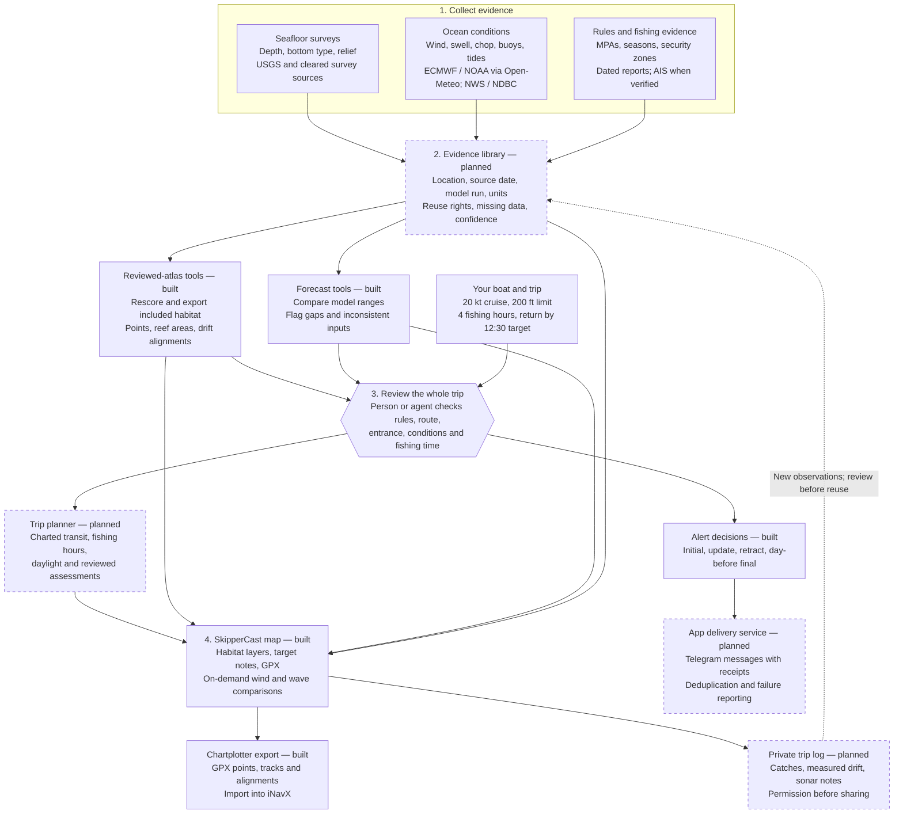
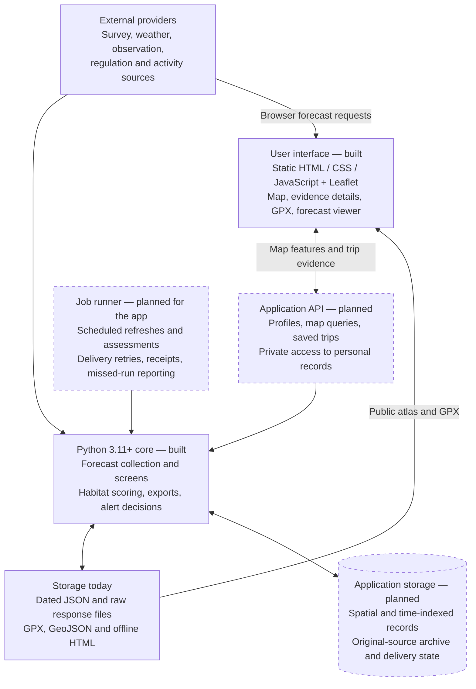
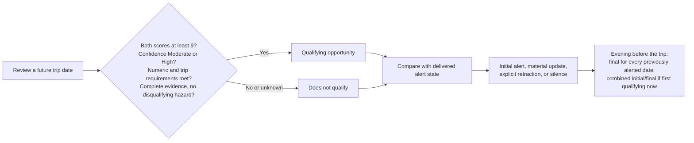

# How SkipperCast will work

SkipperCast brings together **where to investigate, when a trip is workable, and the evidence behind each recommendation**. The first web map, target notes, GPX downloads, forecast comparisons, Python tools, and dated atlas are built. The complete trip planner, shared evidence store, and public-app delivery integration remain planned.

In these diagrams, **dashed boxes are planned application components**. Solid boxes identify available inputs, existing tools, or the current person/agent review step. Arrows describe the intended data flow, not a claim that every connection is already automated.

## From data to a fishing plan

The example boat settings are editable planning inputs, not a promise that the boat can always cruise at 20 knots. A trip needs four actual fishing hours after transit and harbor time, a 12:30 return target, and a 13:00 deadline. A plotted fishing alignment does not establish a navigable route to it.

The current habitat tool re-exports a reviewed dataset and recomputes its terrain score; **automatically turning new surveys into new fishing areas is future GIS work**. Likewise, the collector preserves evidence and numerical screens, while whole-trip scoring and legal/local review remain person- or agent-assisted.

## What the chart layers mean

These are layers on the map, with their shipped and planned status shown separately.

| Chart layer | Data behind it | What the angler sees | Current status |
| --- | --- | --- | --- |
| Base chart and depth | OpenStreetMap for web geographic context; current nautical chart in iNavX | Shoreline context in the web map; navigation and charted contours in the chartplotter | Web base map built with Leaflet / OSM; it is not a nautical chart |
| Restrictions | Current official MPA boundaries/rules, security zones, seasons and species constraints | Clearly labeled restricted areas and date-sensitive rule notes | Dated research screen exists; current in-app overlays/checks are planned |
| Fishing habitat | Reviewed survey depth, bottom character, relief and terrain metrics | Ranked points, partial reef outlines, optional structure alignments | Web layers and public exports built: 132 points, 107 outlines, 31 alignments |
| Ocean conditions | Forecast wind/gusts, significant seas, available swell height/period/direction, observations, reference tides and supported current data | Time-selected conditions with model disagreement, age and missing-data indicators | Browser wind/wave comparisons and three sample labels built; observation/tide/current overlays remain planned |
| Fishing activity evidence | Identity-verified AIS, properly sourced dated catches, and permitted user observations | Evidence labels and dates; an activity layer only where support exists | Research only; no AIS-confirmed charter hotspots in the current edition |
| Your trip | Private boat profile, charted transit, selected grounds, fishing window and return deadline | Proposed trip timeline and route, kept distinct from fishing alignments | Public app planner and private journal planned |

All layers need a source/date/evidence view. A habitat grade, forecast confidence, and verified fishing activity are **different attributes**; the app must not collapse them into one unexplained “good spot” score. Port San Luis tides remain a nearby reference, not Morro Bay bar-current predictions.

## Software stack

The web app uses static HTML, CSS, JavaScript, Leaflet, and OpenStreetMap, with Sites configured for static hosting. It requests forecasts directly from providers. The Python core uses the standard library and runs independently. An application API, database, nautical chart provider, and durable public-app jobs remain unimplemented.

The existing personal forecast monitor and private Telegram integration operate separately from the public app. They can inform a later integration, but cloning this repository does not start a schedule or connect a messaging account. See [the web app guide](web-app.md) for current hosting and local-use instructions.

## Recommendation and notification flow

Comfort and fishing conditions are separate scores; overall is the lower score. The gate depends on a reviewed assessment, not simply on wind/wave numbers. Trip requirements include four actual fishing hours, legal grounds, the depth limit, and the complete departure-to-return window. Previously alerted dates require a final even if unchanged or retracted. A missed final assessment is reported honestly. Delivery state changes only after a confirmed receipt. See the [fixed rubric](assessment-rubric.md) and [forecast workflow](forecast-workflow.md).

For exact source rights and the public atlas's smaller geographic coverage, see [data sources](data-sources.md). For the current modules and their boundaries, see [architecture](architecture.md).
